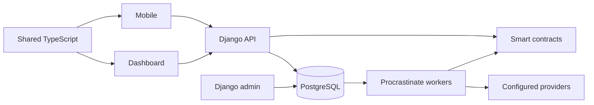

# Architecture

[Documentation](../README.md) · [Product and terminology](../product.md)

The dashboard and mobile client call one Django API. Django stores application
records in PostgreSQL and queues background work through Procrastinate. Workers
and operator actions communicate with the chain and configured providers.
Smart contracts enforce the share cap and recipient whitelist. Django admin is
the operator interface.

Redis supplies request quotas and trading events; it does not run the job queue.
Private storage and the scanner are required for uploaded evidence. The diagram
shows the main relationships, not every synchronous provider call.

## Follow a lifecycle

1. [Company approval and investor eligibility](companies-and-eligibility.md).
2. [Contract deployment and share issuance](contracts-and-issuance.md).
3. [Offering publication](offerings.md) and [subscriptions/allotment](subscriptions.md).
4. [Register of members](register.md).
5. [Wallets and valuation](wallets-and-valuations.md), [transfers](transfers.md)
   and [secondary trading](trading.md).

## Cross-cutting mechanisms

| Concern | Read |
| --- | --- |
| Backend app ownership, layers and admin actions | [Backend](backend.md) |
| Shared package and design tokens | [Clients](clients.md) |
| Sessions, cookies, bearer tokens and revocation | [Authentication](authentication.md) |
| Database roles, principals and tenant isolation | [Tenancy](tenancy.md) |
| Uploaded files, evidence and retention | [Files and retention](files-and-retention.md) |
| Native transport and secrets | [Mobile security](mobile-security.md) |
| Scanners, provider views and temporary files | [Mobile lifecycles](mobile-lifecycles.md) |
| Future operator signing integration | [Outgoing signing foundation](outgoing-signing.md) |

For commands and recovery procedures, continue to [operations](../operations/README.md).
For exact transaction protocols, use the [reference index](../reference/README.md).
