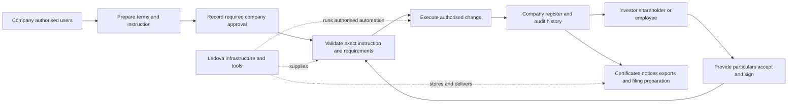

# Company-managed registers

[Product](../product.md) · [Decisions](../decisions.md#company-managed-registers-and-one-product) · [Roadmap](../roadmap.md)

**Status:** Accepted product direction; phase 1 product-mode retirement delivered.
[Representative authority requests](../plans/company-managed-registers/authority-requests.md)
can be submitted, withdrawn or admitted through explicit self-declaration in both
clients, retaining private evidence and history. Initial appointments record scoped
capabilities, expiry and self-revocation after the existing configured identity and
ABR checks. The API also supports invitations, scoped team delegation,
administrator team reads and retained revocation. Team web/mobile screens,
legacy-owner migration and dependent company workflows remain planned.
**Date:** 3 October 2026, Australia/Sydney.
**Decision maker:** Project owner, in the instruction defining this direction.

The [implementation index](../plans/company-managed-registers/README.md) records
GitHub delivery tracking and the [complete documentation audit](../plans/company-managed-registers/documentation-audit.md).

## Decision

**Ledova operates the platform. Companies operate their own share registers.**
Investors, shareholders and employees interact directly with those companies.
Ledova supplies infrastructure, software, records, workflows, validation,
automation and tools. Routine company register work must not require Ledova
staff to perform or approve it.

There is one registry product. The `registry` / `single_issuer` product-mode
distinction is [retired](../operations/upgrades.md#one-registry-product).
A private internal instance uses the same software, features
and authority model. Hosting does not select a separately maintained product.
This decision does not change the software licence or establish a legal finding.

Today, companies submit proposals that only platform staff can review and apply;
some submissions lack client forms. Staff also handle payment, allotment and
publication work. Replace these dependencies with explicit company authority
and participant-facing tools while preserving evidence and durable history.

## Goals

1. Complete a normal company/participant register lifecycle with zero routine
   platform-staff actions, global staff privilege grants, admin screens or manual DB edits.
2. Bind every company action to current authority for that company and capability;
   revocation stops a new action from an open session or pending job.
3. Identify the human decision maker, company mandate, evidence and exact effect
   separately from the automated executor.
4. Expose the core journey in web/mobile without undocumented owner API calls.
5. Preserve company, participant, document, transaction and audit data during
   deployment-mode and authority migrations.

The acceptance recording counts company decisions, participant actions,
automated execution and exceptional support interventions separately.

## User outcomes and consequences

- As a company administrator, I can establish the register, appoint my team and
  prepare changes without requesting a Ledova employee's action.
- As an authorised company approver, I can approve the exact decision and its
  evidence so the software executes the company's instruction.
- As a shareholder or employee, I can confirm my particulars, accept an offer
  and obtain my own records and certificates directly from the company workflow.
- As platform support, I can diagnose and recover technical failures under a
  recorded support scope without assuming a company mandate.

The chosen approach replaces two product variants and routine staff execution
with one product and company authority. Keeping the earlier staff-run model
would preserve existing admin paths but would not satisfy the owner's decision.
The consequence is migration work across clients, services, policies and triggers;
the benefit is that normal register completion no longer depends on Ledova staff
availability. Technical operations, meaningful validation and historical evidence
remain necessary. This plan does not add a second self-hosted roadmap or declare
legal, signature or filing requirements resolved.

## Responsibility and company access

| Party | Target responsibility |
| --- | --- |
| Company | Share structure, register, offers, eligibility requirements, decisions, issues, transfers, corrections, corporate actions, certificates and filing preparation |
| Authorised company users | Prepare/approve within recorded company mandates, using individual accounts |
| Investor, shareholder or employee | Supply particulars, inspect permitted records, apply/accept, sign and authorise their own payments and wallet actions |
| Company's appointed adviser/provider | Explicitly delegated tasks within that company's capability scope |
| Platform staff | Availability, security, support, incidents and specifically assigned payment/crypto functions; no standing mandate for ordinary company register decisions or entries |
| Automation | Validate/execute exact authorised instructions, retain provenance, reconcile and expose failures without inventing approval |

Introduce active company administrative memberships, scoped capabilities,
invitations, mandates and revocation. Proposed bundles are company administrator,
register administrator, approver and finance user; final bundles are implementation
design. `RegisterMember` remains a shareholder record, not an administrative role.
Participant access to one's holding/notices does not imply company admin access.

Platform permissions and company appointments are independent. Company membership
must not confer global staff privileges. Company capabilities come from recorded
company appointments, never from a platform staff role. Routine register workflows
must work with company-authorised users who have no platform staff access.
Existing `Company.owner` can seed administrator access, but must not silently
establish director authority or approve pending instructions.

Company policy determines which capabilities may be combined and when a separate
approver is required. Preserve director conflict rules; do not invent a universal
Ledova reviewer or compulsory two-person rule. Retain external resolutions and
signatures as evidence without requiring every director to have an account.

Existing checks remain enforceable. Missing evidence, conflicting identity or an
unavailable provider does not become success. Shareholder/employee access to
their own records is independent of eligibility for unrelated investments.
Wallet proof is required for wallet-dependent actions, not every imported or
non-tokenised register member.

Bootstrap starts with fresh company and participant signup. Establish initial
company access through the representative's authorisation declaration, retaining
the existing representative identity check and ABR company lookup. The selected
[representative authority route](#representative-verification) is self-declaration,
followed by scoped in-app delegation. It does not approve pending instructions
or replace action-specific company approvals.
Company activation becomes a validated workflow outcome when its configured
requirements are met, rather than an unconditional platform-staff approval.
Company-appointed approvers control offering publication under recorded terms
and applicable eligibility rules.

Identity-provider results and company/provider eligibility decisions must be
attributable, live and bound to their applicable company/context. Preserve
expiry, revocation and participant evidence privacy; company administration does
not grant unrestricted access to private financial/identity files. Reusable
verification facts do not automatically approve investing in every company.
Participant wallet-ownership proof is already self-service. Company-specific
wallet/whitelist approval is a separate decision that needs company capability
and provider/check evidence before automated application.

### Representative verification

The owner's [4 October 2026 self-declaration decision](https://github.com/Ledova/ledova/issues/862#issuecomment-5973451112)
establishes the initial representative's authority through their declaration that
they are authorised to act for the company. The company registers itself and
provides its own company and share information. It remains responsible for that
information, ASIC filings and legal obligations. Companies and investors are
responsible for their own actions; Ledova supplies infrastructure and tools and
minimises its involvement wherever reasonably possible. False information and
impersonation are matters for regulators and law enforcement.

The [accepted refinements](https://github.com/Ledova/ledova/issues/862#issuecomment-5973465105)
require company details to be shown as **provided by the company**, never
**verified by Ledova**; the terms make the company responsible for them. Ledova
changes company administrators only when the company's existing administrators
do it, or when a court or regulator directs it. A person recovering their own
account through normal account recovery is a separate matter; it does not
appoint a replacement company administrator.

The earlier same-day [ASIC officeholder decision](https://github.com/Ledova/ledova/issues/862#issuecomment-5970984155)
and [InfoTrack selection](https://github.com/Ledova/ledova/issues/862#issuecomment-5971158175)
are superseded history. No ASIC search, broker, uploaded ASIC extract or InfoTrack
agreement is required for representative authority. Remove those admission
prerequisites and the rule that an uploaded declaration cannot establish
authority; they no longer block #862–#873. Preserve retained records and private
evidence rather than purging the earlier request lifecycle.

The existing representative identity check and ABR company lookup remain
unchanged. A declaration does not turn either check into a company-provided
success result. Keep ordinary account security, tenant isolation and
signed-transaction safeguards. Do not add verification to catch impersonation or
fraud unless a legal duty falls on Ledova itself. If one is identified, cite it
and raise it with the owner rather than building the check; the
[legal positions](../legal/positions.md) remain a dated research record.

Other representatives receive in-app delegation from authorised company users
within their recorded delegatable scope. Memberships, capabilities, invitations,
expiry and revocation remain in scope. Subsequent actions require their applicable
company mandate, capability and exact approval; self-declaration does not approve
an issue or payment. Capability bundles and company approval policy still need
implementation design. The delivered
[initial appointment lifecycle](../plans/company-managed-registers/authority-requests.md)
records exact self-declaration admission, scope, expiry and self-revocation.
Invitations, team delegation, legacy-owner migration and dependent domain actions
remain planned. Pending proposals and withdrawals retain their original history.

## Required self-service workflows

| Workflow | Company | Participant | Tools/automation |
| --- | --- | --- | --- |
| Setup | Provide company/share information, declare representative authorisation and invite team | Verify account and accept invitation | Existing identity/ABR checks; record declaration and scoped appointments |
| Opening/import | Import particulars/structure, resolve differences and approve initial records | Confirm particulars when requested | Validate totals/duplicates, retain source and apply exact opening |
| Issue/employee grant | Prepare terms/resolution, select recipients and approve exact issue | Apply/accept, supply information and sign | Validate authority/limits; record effect and tokenise when the selected workflow requires it |
| Paid subscription | Publish terms, decide applications, issue instructions, reconcile receipts and authorise allotment | Apply, inspect instructions and pay company/provider | References, reconciliation evidence and exactly-once authorised allotment |
| Member/wallet link | Resolve identity and approve mapping | Confirm particulars and prove wallet control when needed | Conflicts/duplicates checks and retained proof |
| Transfer | Record required company decision; accept/refuse register change | Agree terms and sign respective instruments/actions | Holdings/restrictions checks; separate settlement status and approved entry |
| Correction/reconciliation | Investigate and authorise reasoned correction | Request correction and provide evidence | Detect discrepancies and append correction without overwriting history |
| Certificates/access | Prepare/approve certificates, inspection copies and exports | Read own certificate/permitted records; request updates | Issuer identity, version, provenance and access controls |
| Resolutions/distributions | Publish to correct roll; record decisions and payment evidence | Read, acknowledge, vote or receive | Frozen roll, calculations, notices and history |
| Corporate actions/filings | Authorise supported action, review figures and record filing outcome | Review resulting holdings/rights/notices | Checked preparation and clear gap/failure statuses |

ASIC tools begin with checked figures, supporting documents, reminders and
recorded submission outcomes. A generated draft is not a lodged filing. Direct
filing integration must retain company authorisation and provider/regulator
response before claiming submission/acceptance. Forms, signatures, deadlines and
legal effects remain questions for existing regulatory work, not findings here.

## Existing gates to replace

| Current implementation | Change needed |
| --- | --- |
| Staff company approval/activation, offering publication and classification review | Verified onboarding and company-owned offering/eligibility workflows using configured checks or the company's appointed providers; no unconditional Ledova reviewer dependency |
| `Company.owner`, global staff groups and model permissions | Company memberships/capabilities, mandates and revocation |
| Owner proposal APIs, several without forms | Company prepare/preview/approve/apply client actions |
| Staff evidence review and register-opening/link/instruction/import/correction guards | Company authority at API, service, worker, policy and trigger boundaries |
| Staff-only DB decision/issuance triggers; customer ledger writes refused | Bounded company-authorised commands, preserving guarded system execution |
| Operator payment settings and staff subscription/allotment actions | Company payment settings/decisions with exact company issue authority |
| Staff whitelist, issuance and reconciliation acknowledgement | Company capabilities for dependent actions, preserving eligibility/finality and exact discrepancy checks |
| Admin-only outputs and staff publication/ballot/payment workflows | Company tools and participant read/response flows |
| Operator console names the platform as every company's register keeper | Attribute company administration and each actual decision maker correctly |

Relevant existing sources include
[register reviewers](../../backend/tokens/services/register_openings.py),
[instruction decisions](../../backend/tokens/services/register_instructions.py),
[document review](../../backend/companies/services/document_review.py),
[register outputs](../../backend/tokens/admin/register_output.py),
[company scopes](../../backend/shared/db/policies.py),
[bounded issuer reads](../../backend/tokens/views/share_token.py), and
[console keeper attribution](../../backend/operators/services.py).

Imported classes can currently open without a contract, but later issues,
transfers and publications depend on tokenisation. Company-managed traditional
register workflows need genuine non-tokenised ledger commands where supported,
including non-paid grants and members with no wallet. They must record company
authority and actual register effects without fabricated chain receipts. Later
tokenisation must mirror existing holdings rather than issue them a second time.
This is separate implementation work, not a consequence of changing permissions.

Removing `is_staff` or adding a button is insufficient: database guards also
reject customer decisions. Do not give customer requests unrestricted privileged
connections or ledger writes. Reuse bounded system services behind company
authorisation, with the exact command and commit-time authority recheck. A
technical privileged DB role does not imply human Ledova approval.

Preserve tenant isolation, private evidence, documentary fingerprints, immutable
decisions and exact company/class/recipient/quantity bindings; whole-share
arithmetic, caps/headroom, wallet possession where needed and member identity;
payment evidence, idempotency, locks, append-only corrections and retention;
separate receipt/finality, settlement and register states. Keep normal recovery
semantics for already submitted signatures/transactions. Never manually mark an
uncertain execution completed or manufacture company authority through support.

## Delivery sequence

1. **Remove product modes.** Remove model/admin/API/client field and mode-only
   evidence branches; keep historical migrations and add `RemoveField`.
   Supporting evidence retains current registry behaviour, private access,
   reviewer restrictions, retention and audits; no purge or replacement mode
   flag. Coordinate client/API release: removing the response field first would
   make the dashboard's `deploymentMode === 'registry'` hide evidence. Rollback
   recreates a default field, not each discarded historical mode choice.
2. **Company authority.** Add memberships, capabilities, invitations, mandates
   and revocation. Seed owners without inventing approvals. Prove API, DB and
   worker authority/isolation before exposing new writes.
3. **Register setup/change tools.** Openings, imports, particulars, links and
   corrections, with preparation, required company approval and application.
   Adapt services, RLS and DB triggers together; retain current ledger protections.
   Add explicit non-tokenised issue/transfer and member-administration paths,
   preserving supply and genuine authority without requiring a wallet or
   manufacturing chain completions. Design subsequent tokenisation as a mirror.
   Replace routine staff onboarding/activation and eligibility dependencies with
   declared company authority and the existing identity/ABR and participant
   eligibility checks. Self-declaration establishes representative authority;
   it does not fabricate success for a separate configured provider check.
4. **Primary relationship.** Company-controlled offering publication and investor
   application decisions, payment instructions,
   receipt/refund evidence and exact issue/allotment authority. Primary payments
   name company/provider. Preserve existing instruction snapshots and migrate
   secondary market deposit/settlement separately.
5. **Shareholder administration.** Supported transfer decisions, publications,
   resolutions, distributions, certificates and inspection/export workflows.
   Unsupported corporate actions remain explicit, never appear complete.
6. **Filing tools and new journey.** Checked preparation and genuine submission
   outcomes where supported; record company/participant completion with zero
   routine staff actions. Preserve the earlier 62-screen staff-assisted journey
   as historical evidence; capture new screens after implementation works.

Each increment includes schema/API/client changes and relevant verification.
Mode removal alone does not deliver company-managed registers. Current guides
remain implementation references until their described workflows change.

## Acceptance criteria

- Company A's appointee cannot read or act on company B's private records; reject
  foreign company/class/member/document references, even for a shared owner.
- Initial admission records the representative's authorisation declaration,
  retaining the existing identity check and ABR lookup. Company details are
  attributed to the company, with responsibility stated in the terms, and never
  labelled verified by Ledova. Administrator changes require existing company
  administrators or court/regulator direction; own-account recovery remains separate.
- Preparing an issue without approval authority succeeds; applying it fails
  until required company approval exists. Global staff permissions do not count
  as that appointment, and shareholder status grants no register admin rights.
- Opening, exact issue/allotment and resulting certificate complete without any
  Ledova staff action when required company/participant decisions exist.
- Fresh company and participant signup reaches evidenced company activation,
  company-approved offering publication and the required identity/classification
  outcomes without pre-verified fixtures or routine staff approval. Unresolved,
  expired or revoked checks block the affected action; wallet ownership and
  company-specific whitelist approval remain independently recorded.
- Revocation after preview, stale/expired confirmations and changed evidence or
  terms block a new effect; committed entries retain their genuine history.
- Duplicate/concurrent requests produce one effect; changed retries conflict;
  failed decisions roll back atomically. Raw SQL cannot forge approval or mutate
  immutable ledger history/projections.
- Missing authority, director conflict, unpaid subscription requiring payment, insufficient headroom,
  conflicting identity, chain reorganisation or changed finality policy produce
  actionable pending/refused outcomes, never invented completion.
- Shareholders/employees read their own records/notices independently of unrelated
  offering eligibility; no wallet is required where no chain action is involved.
- Receipt, issue authority, execution, holding and register effect remain separate
  and reconcile to the same quantity. Payment alone does not create an issue.
- A supported non-paid employee grant or other authorised non-paid issue records
  its genuine terms and authority without inventing a receipt or paid subscription.
- Supported non-tokenised register issues, transfers and publications operate on
  genuine company-authorised ledger events without a fabricated chain transaction
  or compulsory wallet; any later tokenisation preserves rather than doubles supply.
- Outputs retain requester, instruction, register sequence and digest. Filing
  drafts stay preparation; submitted/accepted status needs actual evidence.
- Upgrading either old mode preserves records, private-evidence restrictions,
  retention and historical actors; private instances use identical capabilities.

## Verification when implementation begins

Mode removal needs focused operator/document tests, a historical-model migration
test from each old value, evidence-availability client tests and regenerated
OpenAPI/shared types. Check migration drift and API/client contract gates in a
coordinated release. No chain change is implied by removing the field.

Authority increments need both ordinary and scoped backend suites plus role/
policy checks, including direct SQL/ORM forgery, cross-company IDs, preview
revocation, atomic rollback and identical/changed retries. Existing economic,
evidence, ledger and finality regression coverage must remain meaningful while
staff-only expectations become company-authority tests.

Client verification covers the same company/participant actions on web/mobile,
including failure recovery and own-record privacy. Issuance/whitelist changes
also need isolated local-chain evidence. Follow
[repository testing](../development/testing.md) and the
[gate inventory](../development/gates.md); the documentation-only decision does
not itself prove any new workflow works.

## Implementation decisions still needed

Self-declaration is the selected bootstrap route; ASIC/InfoTrack prerequisites
are superseded. Exact capability bundles, approval policies, declaration and
terms capture, external-signature capture and delegation need detailed design
against company workflows. Implement administrator changes under the accepted
existing-administrator or court/regulator rule, separate from own-account recovery.
Signature/filing/legal requirements remain in the regulatory pathway. No separate
self-hosted product roadmap is required.
