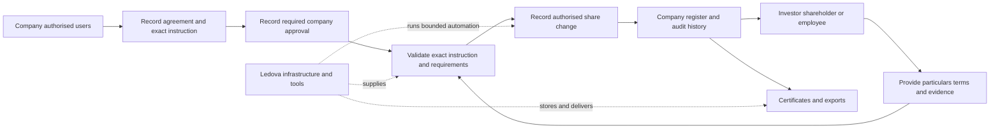

# Company-managed registers

[Product](../product.md) · [Decisions](../decisions.md#company-managed-registers-and-one-product) · [Roadmap](../roadmap.md)

**Status:** Accepted product direction, reprioritised on 9 October 2026.
Development-workflow simplification (#943) comes first; the essential registry
scope below replaces the earlier all-workflow completion sequence.
Phases 1 and 2 delivered.
The company-authority foundation is delivered by [PR #911](https://github.com/Ledova/ledova/pull/911)
at commit `13684719c5245f1d61809d46e37a904f833e1c6d`.
[Representative authority requests](../plans/company-managed-registers/authority-requests.md)
can be submitted, withdrawn or admitted through explicit self-declaration in both
clients, retaining private evidence and history. Initial appointments record scoped
capabilities, expiry and self-revocation after the existing configured identity and
ABR checks. Both clients and the API support invitations, scoped team delegation,
appointment history, administrator team reads and retained revocation. The upgrade
records existing owners as administrators with retained legacy provenance;
current administrators and draft owners can manage bounded
[company information and documents](../plans/company-managed-registers/company-information.md)
through both clients and the guarded API. Administrative changes and private
company-document access require current personal `admin` for the exact company,
with bounded setup for the current active, email-verified owner of an unrooted
draft. Retained
initial or legacy-owner appointment history closes that exception permanently.
Expiry and revocation block new administrative effects; API, service and database
controls enforce company isolation and reject SQL/ORM forgery.
Current owners retain bounded metadata reads and their existing domain conditions;
this read access supplies no administrative capability or private document access.
The [administrator activation increment](../plans/company-managed-registers/company-activation.md)
adds evidenced company activation without routine staff onboarding. Company-specific
participant eligibility remains part of #863. Its [records and API foundation](../plans/company-managed-registers/company-eligibility.md)
landed through [PR #915](https://github.com/Ledova/ledova/pull/915).
[PR #917](https://github.com/Ledova/ledova/pull/917) implements the coherent
consumer/client conversion: current exact-company investment admission, separate
account readiness, authenticated market streams and retained private source
history. New eligibility-loss instructions can only remove wallet approval; new global
staff classification decisions are retired. The first #864 increment lets a current appointee holding
administration or a register capability read the company's register and retained
register proposals. The second lets the company run register imports through the
API: it uploads its own evidence, states the ASIC figures, and approves and
applies the import with no Ledova staff review
([import process](../operations/register-foundation.md#importing-an-existing-register)),
and the Register in both clients runs those steps. The third lets the company run
compensating corrections through the API in the same way, with its own authority
document ([correction process](../operations/register-foundation.md#compensating-corrections)).
The fourth lets a current company approver or administrator acknowledge a
reconciliation discrepancy through the API, with a written reason and no Ledova
staff step ([acknowledgement](../operations/register-foundation.md#acknowledging-a-discrepancy)).
The Register in both clients also lists each class's entries and runs those
corrections and acknowledgements. The fifth lets the company open a deployed
class's register from the chain through the API: preparation captures the chain
boundary with the company's own authority document, and the company approves
and applies the opening with no Ledova staff review
([opening process](../operations/register-foundation.md#opening-the-register-from-the-chain)).
The Register in both clients runs those openings too. The sixth lets the
company change a member's name and residential address through the API, with a
reason and its own supporting document, the latest "as at" date winning between
imports and changes
([particulars changes](../operations/register-foundation.md#changing-a-members-particulars)),
and the Register in both clients runs those changes too. The seventh lets the
company link member wallets through the API with its own authority document,
recording the issues and transfers that waited for a link
([wallet links](../operations/register-foundation.md#linking-wallets-after-the-opening)),
and the Register in both clients runs those links too. #864 is complete through
[PR #936](https://github.com/Ledova/ledova/pull/936). The first #865 increment adds
[non-paid register grants](../plans/company-managed-registers/register-grants.md)
to new or existing walletless members of an imported non-tokenised register,
with retained company authority and genuine ISSUE entries. [Direct non-paid
transfers](../plans/company-managed-registers/register-transfers.md) add new and
returning recipients, attributable cessation history and genuine roll/certificate
inputs. The first #867 increment implements
[company-authorised empty deployments](../plans/company-managed-registers/company-deployments.md),
retaining exact human approval separately from the technical signer and original
receipt/projection recovery. It issues no shares and mirrors no populated
register. The second [wallet increment](../plans/company-managed-registers/company-wallet-approvals.md)
retains genuine possession proof and explicit participant nomination separately
from company approval and original journal execution. The third
[non-paid on-chain grant increment](../plans/company-managed-registers/company-register-issues.md)
implements exact company instructions and a first-member LINK consumer.
The fourth [capital increment](../plans/company-managed-registers/company-capital-increases.md)
implements exact company decisions through the existing cap-only
execution journal. The fifth [pause/unpause increment](../plans/company-managed-registers/company-pause-changes.md)
implements exact company decisions and original observation or
transaction recovery. Paid issuance remains a later #867 increment.
#866 and #868–#873 remain planned within the revised core/deferred scope below.
Their company/member, allotment and register authority is separate.
**Date:** 3 October 2026; priority amendment 9 October 2026, Australia/Sydney.
**Decision maker:** Project owner, in the instruction defining this direction.

The [implementation index](../plans/company-managed-registers/README.md) records
GitHub delivery tracking and the [complete documentation audit](../plans/company-managed-registers/documentation-audit.md).

## Decision

**Ledova operates the platform. Companies operate their own share registers.**
Investors, shareholders and employees interact directly with those companies.
Ledova supplies infrastructure, software, records, workflows, validation,
automation and tools. Routine company register work must not require Ledova
staff to perform or approve it.

There is one registry product. The `registry` / `single_issuer` product-mode
distinction is [retired](../operations/upgrades.md#one-registry-product).
A private internal instance uses the same software, features
and authority model. Hosting does not select a separately maintained product.
This decision does not change the software licence or establish a legal finding.

The owner's [9 October priority amendment](../decisions.md#essential-registry-and-development-workflow-priority)
puts #943 first, then a simple register for non-paid employee awards and vesting
records, externally arranged investor capital and company-approved allotments,
accurate ownership, member access and basic outputs. Core outputs (#871) and
core acceptance (#873) no longer wait for deferred trading (#869), advanced
governance (#870) or filings (#872). The earlier required integrated AUD-payment
expansion is deferred; #868 now focuses on external capital records and allotment.

Current grants issue outright shares; a stored agreement does not implement
vesting. Structured award/vesting records and new off-chain investor allotments
remain delivery gaps. Contractual entitlements and actual issued ownership must
stay distinct. No legal/tax rule engine or option-exercise scheme is selected.
The single account-to-member association remains #866 work; this amendment does
not select its invitation/access policy.

Useful existing chain and payment functionality, evidence and recovery are
retained. Optional crypto on-ramp purchases remain personal investor activity;
companies must not buy cryptocurrency through it, and #920's investor and
provider-lifetime guards stand. AUD capital can be recorded from genuine
company-provided evidence without claiming Ledova collected or settled funds.
Future payment mechanics remain an owner decision. A core register entry needs
no payment integration, wallet or fabricated chain transaction.

Several remaining domain workflows still depend on platform staff. Replace the
core dependencies with company/member tools; retain deferred functionality and
its existing guards until a separately authorised replacement lands.

## Goals

1. Complete the essential company/participant register lifecycle with zero routine
   platform-staff actions, global staff privilege grants, admin screens or manual DB edits.
2. Bind every company action to current authority for that company and capability;
   revocation stops a new action from an open session or pending job.
3. Identify the human decision maker, company mandate, evidence and exact effect
   separately from the automated executor.
4. Expose the core journey in web/mobile without undocumented owner API calls.
5. Preserve company, participant, document, transaction and audit data during
   deployment-mode and authority migrations.

The acceptance recording counts company decisions, participant actions,
automated execution and exceptional support interventions separately.

## User outcomes and consequences

- As a company administrator, I can establish the register, appoint my team and
  prepare changes without requesting a Ledova employee's action.
- As an authorised company approver, I can approve the exact decision and its
  evidence so the software executes the company's instruction.
- As a shareholder or employee, I can confirm my particulars, inspect my award
  and ownership records, and obtain permitted records and certificates from the
  company workflow.
- As platform support, I can diagnose and recover technical failures under a
  recorded support scope without assuming a company mandate.

The chosen approach replaces two product variants and routine staff execution
with one product and company authority. Keeping the earlier staff-run model
would preserve existing admin paths but would not satisfy the owner's decision.
The consequence is migration work across clients, services, policies and triggers;
the benefit is that normal register completion no longer depends on Ledova staff
availability. Technical operations, meaningful validation and historical evidence
remain necessary. This plan does not add a second self-hosted roadmap or declare
legal, signature or filing requirements resolved.

## Responsibility and company access

| Party                                | Target responsibility                                                                                                                                                 |
| ------------------------------------ | --------------------------------------------------------------------------------------------------------------------------------------------------------------------- |
| Company                              | Share structure, register, offers, eligibility requirements, decisions, issues, transfers, corrections, corporate actions, certificates and filing preparation        |
| Authorised company users             | Prepare/approve within recorded company mandates, using individual accounts                                                                                           |
| Investor, shareholder or employee    | Supply particulars, inspect permitted records, apply/accept, sign and authorise their own payments and wallet actions                                                 |
| Company's appointed adviser/provider | Explicitly delegated tasks within that company's capability scope                                                                                                     |
| Platform staff                       | Availability, security, support, incidents and specifically assigned payment/crypto functions; no standing mandate for ordinary company register decisions or entries |
| Automation                           | Validate/execute exact authorised instructions, retain provenance, reconcile and expose failures without inventing approval                                           |

Introduce active company administrative memberships, scoped capabilities,
invitations, mandates and revocation. Proposed bundles are company administrator,
register administrator, approver and finance user; final bundles are implementation
design. `RegisterMember` remains a shareholder record, not an administrative role.
Participant access to one's holding/notices does not imply company admin access.

Platform permissions and company appointments are independent. Company membership
must not confer global staff privileges. Company capabilities come from recorded
company appointments, never from a platform staff role. Routine register workflows
must work with company-authorised users who have no platform staff access.
Existing `Company.owner` can seed administrator access, but must not silently
establish director authority or approve pending instructions.

Company policy determines which capabilities may be combined and when a separate
approver is required. Preserve director conflict rules; do not invent a universal
Ledova reviewer or compulsory two-person rule. Retain external resolutions and
signatures as evidence without requiring every director to have an account.

Existing checks remain enforceable. Missing evidence, conflicting identity or an
unavailable provider does not become success. Shareholder/employee access to
their own records is independent of eligibility for unrelated investments.
Wallet proof is required for wallet-dependent actions, not every imported or
non-tokenised register member.

Bootstrap starts with fresh company and participant signup. Establish initial
company access through the representative's authorisation declaration, retaining
the existing representative identity check and ABR company lookup. The selected
[representative authority route](#representative-verification) is self-declaration,
followed by scoped in-app delegation. It does not approve pending instructions
or replace action-specific company approvals.
Company activation becomes a validated workflow outcome when its configured
requirements are met, rather than an unconditional platform-staff approval.
Company-appointed approvers control offering publication under recorded terms
and applicable eligibility rules.

Identity-provider results and company/provider eligibility decisions must be
attributable, live and bound to their applicable company/context. Preserve
expiry, revocation and participant evidence privacy; company administration does
not grant unrestricted access to private financial/identity files. Reusable
verification facts do not automatically approve investing in every company.
Participant wallet-ownership proof is already self-service. Company-specific
wallet/whitelist approval is a separate decision that needs company capability
and provider/check evidence before automated application.

### Representative verification

The owner's [4 October 2026 self-declaration decision](https://github.com/Ledova/ledova/issues/862#issuecomment-5973451112)
establishes the initial representative's authority through their declaration that
they are authorised to act for the company. The company registers itself and
provides its own company and share information. It remains responsible for that
information, ASIC filings and legal obligations. Companies and investors are
responsible for their own actions; Ledova supplies infrastructure and tools and
minimises its involvement wherever reasonably possible. False information and
impersonation are matters for regulators and law enforcement.

The [accepted refinements](https://github.com/Ledova/ledova/issues/862#issuecomment-5973465105)
require company details to be shown as **provided by the company**, never
**verified by Ledova**; the terms make the company responsible for them. Ledova
changes company administrators only when the company's existing administrators
do it, or when a court or regulator directs it. A person recovering their own
account through normal account recovery is a separate matter; it does not
appoint a replacement company administrator.

The earlier same-day [ASIC officeholder decision](https://github.com/Ledova/ledova/issues/862#issuecomment-5970984155)
and [InfoTrack selection](https://github.com/Ledova/ledova/issues/862#issuecomment-5971158175)
are superseded history. No ASIC search, broker, uploaded ASIC extract or InfoTrack
agreement is required for representative authority. Remove those admission
prerequisites and the rule that an uploaded declaration cannot establish
authority; they no longer block #862–#873. Preserve retained records and private
evidence rather than purging the earlier request lifecycle.

The existing representative identity check and ABR company lookup remain
unchanged. A declaration does not turn either check into a company-provided
success result. Keep ordinary account security, tenant isolation and
signed-transaction safeguards. Do not add verification to catch impersonation or
fraud unless a legal duty falls on Ledova itself. If one is identified, cite it
and raise it with the owner rather than building the check; the
[legal positions](../legal/positions.md) remain a dated research record.

Other representatives receive in-app delegation from authorised company users
within their recorded delegatable scope. Memberships, capabilities, invitations,
expiry and revocation remain in scope. Subsequent actions require their applicable
company mandate, capability and exact approval; self-declaration does not approve
an issue or payment. Appointments use flat capabilities; company approval policy
is implemented with the dependent domain workflows. The delivered
[initial appointment lifecycle](../plans/company-managed-registers/authority-requests.md)
records exact self-declaration admission, scope, expiry and self-revocation.
The invitation API and web/mobile screens support team delegation, acceptance,
administrator reads and retained revocation. The legacy-owner upgrade records
administrator appointments for existing companies without an initial appointment,
without inventing declarations or approvals. Dependent domain actions remain
planned. Pending proposals and withdrawals retain their original history.

## Required self-service workflows

These are target workflows, not a claim that every capability is implemented.
The status above and linked increment guides identify delivered behaviour.

| Essential workflow             | Company                                                                   | Participant                                                              | Tools/automation                                                                                            |
| ------------------------------ | ------------------------------------------------------------------------- | ------------------------------------------------------------------------ | ----------------------------------------------------------------------------------------------------------- |
| Setup                          | Supply company/share information, declare authority and appoint team      | Verify account and accept relevant invitation                            | Existing checks, declaration, scoped appointments and revocation                                            |
| Opening/import                 | Import particulars and structure, resolve differences and approve opening | Confirm particulars when requested                                       | Validate totals and duplicates, retain company-provided evidence and exact opening                          |
| Employee award and issue       | Record agreement/schedule, confirm vesting events and approve exact issue | Read terms and accept/sign where the company's arrangement requires it   | Distinguish award entitlement from issued ownership; record actual approved effect without employee payment |
| Investor capital and allotment | Record external agreement/capital evidence and approve exact allotment    | Provide particulars and investment documents                             | Separate commitment, receipt and actual issue; no new collection rail required                              |
| Member access/link             | Resolve member identity and review particulars changes                    | Read permitted own records; prove wallet control only for a chain action | One account association under #866, exact identity and private access                                       |
| Ownership change/correction    | Approve supported direct transfer or reasoned compensating correction     | Supply required instruments or correction evidence                       | Preserve quantities, actors, dates, atomic effects and immutable history                                    |
| Certificates/access            | Prepare company-authorised certificates, inspection copies and exports    | Obtain permitted own outputs                                             | Genuine register sequence, evidence, provenance and access controls                                         |

New integrated payments and marketplace settlement (#869), advanced
publications/voting/distributions (#870), and filing preparation/submission
(#872) are deferred. Preserve existing governed functionality and retained
records. Neither a generated filing draft nor an external receipt establishes
lodgement, regulatory acceptance or share issuance. Future integration choices
remain owner decisions.

## Existing gates to replace

Company appointments and most setup/register commands are already delivered.
Remaining core work is narrower than the original staff-workflow conversion:

| Current boundary                                   | Core work remaining                                                                        |
| -------------------------------------------------- | ------------------------------------------------------------------------------------------ |
| Outright non-paid grants with retained terms       | Record supported award/vesting arrangements separately from actual issued ownership        |
| Staff-attested subscriptions and chain allotment   | Company-provided external capital records and exact company-authorised off-chain allotment |
| No delivered walletless member account association | One #866 association and permitted own-record/particulars workflows                        |
| Staff-prepared outputs                             | Capability-scoped company outputs and permitted member access under #871                   |

Other existing staff publication, settlement and filing workflows retain their
controls; expanding them is deferred. Removing a staff check alone never
establishes company authority or delivers a replacement.

Relevant existing sources include
[register reviewers](../../backend/tokens/services/register_openings.py),
[instruction decisions](../../backend/tokens/services/register_instructions.py),
[document review](../../backend/companies/services/document_review.py),
[register outputs](../../backend/tokens/admin/register_output.py),
[company scopes](../../backend/shared/db/policies.py),
[bounded issuer reads](../../backend/tokens/views/share_token.py), and
[console keeper attribution](../../backend/operators/services.py).

Imported classes open without a contract and now support company-run non-paid
grants to new or existing walletless members, with genuine company authority and
ISSUE entries, and [direct non-paid transfers](../plans/company-managed-registers/register-transfers.md)
with genuine instruments and retained exit/return history. Other unsupported
commands remain explicit; current publications still depend on a deployed class. Each supported
command must retain actual register effects without fabricated chain receipts. Later
tokenisation must mirror existing holdings rather than issue them a second time.
This is separate implementation work, not a consequence of changing permissions.

Removing `is_staff` or adding a button is insufficient: database guards also
reject customer decisions. Do not give customer requests unrestricted privileged
connections or ledger writes. Reuse bounded system services behind company
authorisation, with the exact command and commit-time authority recheck. A
technical privileged DB role does not imply human Ledova approval.

Preserve tenant isolation, private evidence, documentary fingerprints, immutable
decisions and exact company/class/recipient/quantity bindings; whole-share
arithmetic, caps/headroom, wallet possession where needed and member identity;
payment evidence, idempotency, locks, append-only corrections and retention;
separate receipt/finality, settlement and register states. Keep normal recovery
semantics for already submitted signatures/transactions. Never manually mark an
uncertain execution completed or manufacture company authority through support.

## Delivery sequence

The [9 October owner policy](https://github.com/Ledova/ledova/issues/860#issuecomment-6078277168)
and live issue claims supersede the original six-phase all-workflow sequence:

1. **Development workflow (#943).** Measure costly tests and simplify verified
   setup, duplication and scheduling. This work is not blocked by #867.
   Preserve meaningful coverage, applicable green CI and independent review.
   The first timing increment does not deliver all proposed routing or tiers.
2. **Preserved foundation (#861–#865).** Retain the delivered one-product,
   company authority, activation/eligibility, register commands and non-tokenised
   ledger. No replacement product flag or historical migration rewrite is needed.
3. **Essential awards and allotment (#867/#868).** Record supported employee
   award/vesting agreements and actual issues; record external investor capital
   and exact approved allotments. Keep entitlement, receipt and ownership distinct.
   Existing chain work remains guarded; a non-chain entry needs no wallet or mint.
4. **Member access and outputs (#866/#871).** Deliver one association, private
   own-record/particulars workflows, basic certificates and exports. Respect
   each issue's current prerequisites, without waiting for #869/#870/#872.
5. **Core journey (#873).** Verify the essential company/member web/mobile
   journey and preserved migrations. Retain earlier staff-assisted evidence;
   record new screens only after the actual workflows work. #624 remains a
   separate genuine human release acceptance requirement.

#869's new transfer/settlement work, #870's advanced governance and #872's filing
work remain deferred. Their useful existing functionality and history are
preserved. Each delivered increment owns its relevant verification; deferred
work does not block core outputs or acceptance, and is not implicitly complete.

## Acceptance criteria

- Company A's appointee cannot read or act on company B's private records; reject
  foreign company/class/member/document references, even for a shared owner.
- Initial admission records the representative's authorisation declaration,
  retaining the existing identity check and ABR lookup. Company details are
  attributed to the company, with responsibility stated in the terms, and never
  labelled verified by Ledova. Administrator changes require existing company
  administrators or court/regulator direction; own-account recovery remains separate.
- Preparing an issue without approval authority succeeds; applying it fails
  until required company approval exists. Global staff permissions do not count
  as that appointment, and shareholder status grants no register admin rights.
- Opening, exact issue/allotment and resulting certificate complete without any
  Ledova staff action when required company/participant decisions exist.
- Fresh company and participant signup reaches evidenced company activation
  and the required identity/classification outcomes for the selected action
  without pre-verified fixtures or routine staff approval. Unresolved,
  expired or revoked checks block the affected action; wallet ownership and
  company-specific whitelist approval remain independently recorded.
- Revocation after preview, stale/expired confirmations and changed evidence or
  terms block a new effect; committed entries retain their genuine history.
- Duplicate/concurrent requests produce one effect; changed retries conflict;
  failed decisions roll back atomically. Raw SQL cannot forge approval or mutate
  immutable ledger history/projections.
- Missing authority, director conflict, unpaid subscription requiring payment, insufficient headroom,
  conflicting identity, chain reorganisation or changed finality policy produce
  actionable pending/refused outcomes, never invented completion.
- Shareholders/employees read their own records/notices independently of unrelated
  offering eligibility; no wallet is required where no chain action is involved.
- Receipt, issue authority, execution, holding and register effect remain separate
  and reconcile to the same quantity. Payment alone does not create an issue.
- Core register/share journeys do not require a crypto on-ramp purchase.
  Companies cannot open one; permitted investor use remains optional and
  separately verified under #920.
- External investor records retain genuine amount, currency and capital evidence
  separately from company-approved allotment. Do not label a commitment as a
  receipt, a receipt as issued shares, or company evidence as Ledova verification.
  Integrated AUD payment and secondary settlement expansion are deferred.
- A supported employee award records its agreement and vesting terms distinctly
  from actual shares issued. Company-confirmed vesting and issue events do not
  invent a receipt, paid subscription or unsupported legal/tax calculation.
- Supported non-tokenised register issues and direct transfers operate on
  genuine company-authorised ledger events without a fabricated chain transaction
  or compulsory wallet; any later tokenisation preserves rather than doubles supply.
- Basic outputs retain requester, instruction, register sequence and digest.
  Core outputs and acceptance do not require deferred trading, advanced
  governance or filings. Existing filing drafts remain preparation; any
  submitted/accepted status still requires genuine evidence.
- Upgrading either old mode preserves records, private-evidence restrictions,
  retention and historical actors; private instances use identical capabilities.

## Verification when implementation begins

Mode removal needs focused operator/document tests, a historical-model migration
test from each old value, evidence-availability client tests and regenerated
OpenAPI/shared types. Check migration drift and API/client contract gates in a
coordinated release. No chain change is implied by removing the field.

Authority changes need affected ordinary and genuine scoped checks plus role/
policy coverage, including direct SQL/ORM forgery, cross-company IDs, preview
revocation, atomic rollback and identical/changed retries. Existing economic,
evidence, ledger and finality regression coverage must remain meaningful while
staff-only expectations become company-authority tests.

Client verification covers the same company/participant actions on web/mobile,
including failure recovery and own-record privacy. Issuance/whitelist changes
also need isolated local-chain evidence. Follow
[repository testing](../development/testing.md) and the
[gate inventory](../development/gates.md); the documentation-only decision does
not itself prove any new workflow works.

## Implementation decisions still needed

Self-declaration is the selected bootstrap route; ASIC/InfoTrack prerequisites
are superseded. Flat personal and delegatable capabilities, initial declaration
capture and in-app delegation are delivered. Domain-specific approval policies,
action terms and external-signature capture remain to be implemented with their
company workflows. Administrator changes follow the accepted existing-administrator
or court/regulator rule, separate from own-account recovery.
Signature/filing/legal requirements remain in the regulatory pathway. No separate
self-hosted product roadmap is required.
Supported vesting arrangements, documentary capture and the #866 member access
policy remain explicit decisions. No invitation policy, option-exercise scheme
or legal/tax rule engine is selected. Future integrated AUD collection, receipt
verification, reconciliation, refunds and secondary settlement still need owner
decisions before implementation; they are outside the essential registry scope.
