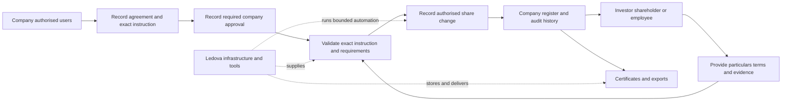

# Company-managed registers

[Product](../product.md) · [Decisions](../decisions.md#company-managed-registers-and-one-product) · [Roadmap](../roadmap.md)

**Status:** accepted product direction, 3 October 2026, reprioritised on
9 October 2026 (Australia/Sydney). **Decision maker:** the project owner. The
[implementation index](../plans/company-managed-registers/README.md) lists the
increments delivered under it and the remaining scope; the
[3 October documentation audit](../plans/company-managed-registers/documentation-audit.md)
is the baseline it started from.

## Decision

**Ledova operates the platform. Companies operate their own share registers.**
Investors, shareholders and employees interact directly with those companies.
Ledova supplies infrastructure, software, records, workflows, validation,
automation and tools. Routine company register work must not require Ledova
staff to perform or approve it.

There is one registry product. The `registry` / `single_issuer` product-mode
distinction is [retired](../operations/upgrades.md#one-registry-product).
A private internal instance uses the same software, features
and authority model. Hosting does not select a separately maintained product.
This decision does not change the software licence or establish a legal finding.

The owner's [9 October priority amendment](../decisions.md#essential-registry-and-development-workflow-priority)
puts #943 first, then a simple register for non-paid employee awards and vesting
records, externally arranged investor capital and company-approved allotments,
accurate ownership, member access and basic outputs. Core outputs (#871) and
core acceptance (#873) no longer wait for deferred trading (#869), advanced
governance (#870) or filings (#872). The earlier required integrated AUD-payment
expansion is deferred; #868 now focuses on external capital records and allotment.

Current grants issue outright shares; a stored agreement does not implement
vesting. Contractual entitlements and actual issued ownership must stay
distinct, and the
[10 October first scopes](../decisions.md#first-scopes-for-employee-awards-and-external-capital)
settle how awards and external capital are first recorded. No legal/tax rule
engine or option-exercise scheme is selected. The single account-to-member
association remains #866 work; its invitation/access policy is not selected.

Useful existing chain and payment functionality, evidence and recovery are
retained. Optional crypto on-ramp purchases remain personal investor activity;
companies must not buy cryptocurrency through it, and #920's investor and
provider-lifetime guards stand. AUD capital can be recorded from genuine
company-provided evidence without claiming Ledova collected or settled funds.
Future payment mechanics remain an owner decision. A core register entry needs
no payment integration, wallet or fabricated chain transaction.

## Goals

1. Complete the essential company/participant register lifecycle with zero routine
   platform-staff actions, global staff privilege grants, admin screens or manual DB edits.
2. Bind every company action to current authority for that company and capability;
   revocation stops a new action from an open session or pending job.
3. Identify the human decision maker, company mandate, evidence and exact effect
   separately from the automated executor.
4. Expose the core journey in web/mobile without undocumented owner API calls.
5. Preserve company, participant, document, transaction and audit data during
   deployment-mode and authority migrations.

The acceptance recording counts company decisions, participant actions,
automated execution and exceptional support interventions separately.

## User outcomes and consequences

- As a company administrator, I can establish the register, appoint my team and
  prepare changes without requesting a Ledova employee's action.
- As an authorised company approver, I can approve the exact decision and its
  evidence so the software executes the company's instruction.
- As a shareholder or employee, I can confirm my particulars, inspect my award
  and ownership records, and obtain permitted records and certificates from the
  company workflow.
- As platform support, I can diagnose and recover technical failures under a
  recorded support scope without assuming a company mandate.

The chosen approach replaces two product variants and routine staff execution
with one product and company authority. Keeping the earlier staff-run model
would preserve existing admin paths but would not satisfy the owner's decision.
The consequence is migration work across clients, services, policies and triggers;
the benefit is that normal register completion no longer depends on platform staff
availability. Technical operations, meaningful validation and historical evidence
remain necessary. This plan does not add a second self-hosted roadmap or declare
legal, signature or filing requirements resolved.

## Responsibility and company access

| Party                                | Target responsibility                                                                                                                                                 |
| ------------------------------------ | --------------------------------------------------------------------------------------------------------------------------------------------------------------------- |
| Company                              | Share structure, register, offers, eligibility requirements, decisions, issues, transfers, corrections, corporate actions, certificates and filing preparation        |
| Authorised company users             | Prepare/approve within recorded company mandates, using individual accounts                                                                                           |
| Investor, shareholder or employee    | Supply particulars, inspect permitted records, apply/accept, sign and authorise their own payments and wallet actions                                                 |
| Company's appointed adviser/provider | Explicitly delegated tasks within that company's capability scope                                                                                                     |
| Platform staff                       | Availability, security, support, incidents and specifically assigned payment/crypto functions; no standing mandate for ordinary company register decisions or entries |
| Automation                           | Validate/execute exact authorised instructions, retain provenance, reconcile and expose failures without inventing approval                                           |

Appointments carry flat capabilities (`admin`, `prepare`, `approve`, `apply`,
`finance` and `read_register`) with invitations, expiry and revocation.
`RegisterMember` remains a shareholder record, not an administrative role, and
participant access to one's holding/notices does not imply company admin access.

Platform permissions and company appointments are independent. Company membership
must not confer global staff privileges. Company capabilities come from recorded
company appointments, never from a platform staff role. Routine register workflows
must work with company-authorised users who have no platform staff access.
Existing `Company.owner` can seed administrator access, but must not silently
establish director authority or approve pending instructions.

Company policy determines which capabilities may be combined and when a separate
approver is required. Preserve director conflict rules; do not invent a universal
Ledova reviewer or compulsory two-person rule. Retain external resolutions and
signatures as evidence without requiring every director to have an account.

Existing checks remain enforceable. Missing evidence, conflicting identity or an
unavailable provider does not become success. Shareholder/employee access to
their own records is independent of eligibility for unrelated investments.
Wallet proof is required for wallet-dependent actions, not every imported or
non-tokenised register member.

Bootstrap starts with fresh company and participant signup. Establish initial
company access through the representative's authorisation declaration, retaining
the existing representative identity check and ABR company lookup. The selected
[representative authority route](#representative-verification) is self-declaration,
followed by scoped in-app delegation. It does not approve pending instructions
or replace action-specific company approvals.
Company activation becomes a validated workflow outcome when its configured
requirements are met, rather than an unconditional platform-staff approval.
Company-appointed approvers control offering publication under recorded terms
and applicable eligibility rules.

Identity-provider results and company/provider eligibility decisions must be
attributable, live and bound to their applicable company/context. Preserve
expiry, revocation and participant evidence privacy; company administration does
not grant unrestricted access to private financial/identity files. Reusable
verification facts do not automatically approve investing in every company.
Participant wallet-ownership proof is already self-service. Company-specific
wallet/whitelist approval is a separate decision that needs company capability
and provider/check evidence before automated application.

### Representative verification

The owner's [4 October 2026 self-declaration decision](https://github.com/Ledova/ledova/issues/862#issuecomment-5973451112)
establishes the initial representative's authority through their declaration that
they are authorised to act for the company. The company registers itself and
provides its own company and share information. It remains responsible for that
information, ASIC filings and legal obligations. Companies and investors are
responsible for their own actions; Ledova supplies infrastructure and tools and
minimises its involvement wherever reasonably possible. False information and
impersonation are matters for regulators and law enforcement.

The [accepted refinements](https://github.com/Ledova/ledova/issues/862#issuecomment-5973465105)
require company details to be shown as **provided by the company**, never
**verified by Ledova**; the terms make the company responsible for them. Ledova
changes company administrators only when the company's existing administrators
do it, or when a court or regulator directs it. A person recovering their own
account through normal account recovery is a separate matter; it does not
appoint a replacement company administrator.

The earlier same-day [ASIC officeholder decision](https://github.com/Ledova/ledova/issues/862#issuecomment-5970984155)
and [InfoTrack selection](https://github.com/Ledova/ledova/issues/862#issuecomment-5971158175)
are superseded history. No ASIC search, broker, uploaded ASIC extract or InfoTrack
agreement is required for representative authority, and an uploaded declaration
can establish it; those prerequisites no longer block #862–#873. Retained
records and private evidence from the earlier request lifecycle are preserved.

The existing representative identity check and ABR company lookup remain
unchanged. A declaration does not turn either check into a company-provided
success result. Keep ordinary account security, tenant isolation and
signed-transaction safeguards. Do not add verification to catch impersonation or
fraud unless a legal duty falls on Ledova itself. If one is identified, cite it
and raise it with the owner rather than building the check; the
[legal positions](../legal/positions.md) remain a dated research record.

Other representatives receive in-app delegation from authorised company users
within their recorded delegatable scope. Subsequent actions require their
applicable company mandate, capability and exact approval; self-declaration does
not approve an issue or payment, and company approval policy is implemented with
each domain workflow. The [authority guide](../plans/company-managed-registers/authority-requests.md)
describes the delivered admission, invitation, delegation, revocation and
legacy-owner upgrade.

## Required self-service workflows

These are the target workflows; the
[implementation index](../plans/company-managed-registers/README.md) says which
are delivered.

| Essential workflow             | Company                                                                   | Participant                                                              | Tools/automation                                                                                            |
| ------------------------------ | ------------------------------------------------------------------------- | ------------------------------------------------------------------------ | ----------------------------------------------------------------------------------------------------------- |
| Setup                          | Supply company/share information, declare authority and appoint team      | Verify account and accept relevant invitation                            | Existing checks, declaration, scoped appointments and revocation                                            |
| Opening/import                 | Import particulars and structure, resolve differences and approve opening | Confirm particulars when requested                                       | Validate totals and duplicates, retain company-provided evidence and exact opening                          |
| Employee award and issue       | Record agreement/schedule, confirm vesting events and approve exact issue | Read terms and accept/sign where the company's arrangement requires it   | Distinguish award entitlement from issued ownership; record actual approved effect without employee payment |
| Investor capital and allotment | Record external agreement/capital evidence and approve exact allotment    | Provide particulars and investment documents                             | Separate commitment, receipt and actual issue; no new collection rail required                              |
| Member access/link             | Resolve member identity and review particulars changes                    | Read permitted own records; prove wallet control only for a chain action | One account association under #866, exact identity and private access                                       |
| Ownership change/correction    | Approve supported direct transfer or reasoned compensating correction     | Supply required instruments or correction evidence                       | Preserve quantities, actors, dates, atomic effects and immutable history                                    |
| Certificates/access            | Prepare company-authorised certificates, inspection copies and exports    | Obtain permitted own outputs                                             | Genuine register sequence, evidence, provenance and access controls                                         |

New integrated payments and marketplace settlement (#869), advanced
publications/voting/distributions (#870), and filing preparation/submission
(#872) are deferred. Preserve existing governed functionality and retained
records. Neither a generated filing draft nor an external receipt establishes
lodgement, regulatory acceptance or share issuance. Future integration choices
remain owner decisions.

## Invariants

Removing `is_staff` or adding a button is insufficient: database guards also
reject customer decisions. Do not give customer requests unrestricted privileged
connections or ledger writes. Reuse bounded system services behind company
authorisation, with the exact command and commit-time authority recheck. A
technical privileged DB role does not imply human Ledova approval, and removing
a staff check alone never establishes company authority.

Preserve tenant isolation, private evidence, documentary fingerprints, immutable
decisions and exact company/class/recipient/quantity bindings; whole-share
arithmetic, caps/headroom, wallet possession where needed and member identity;
payment evidence, idempotency, locks, append-only corrections and retention;
separate receipt/finality, settlement and register states. Keep normal recovery
semantics for already submitted signatures/transactions. Never manually mark an
uncertain execution completed or manufacture company authority through support.
Each supported register command retains actual register effects without
fabricated chain receipts, and later tokenisation mirrors existing holdings
rather than issuing them a second time.

## Acceptance criteria

- Company A's appointee cannot read or act on company B's private records; reject
  foreign company/class/member/document references, even for a shared owner.
- Initial admission records the representative's authorisation declaration,
  retaining the existing identity check and ABR lookup. Company details are
  attributed to the company, with responsibility stated in the terms, and never
  labelled verified by Ledova. Administrator changes require existing company
  administrators or court/regulator direction; own-account recovery remains separate.
- Preparing an issue without approval authority succeeds; applying it fails
  until required company approval exists. Global staff permissions do not count
  as that appointment, and shareholder status grants no register admin rights.
- Opening, exact issue/allotment and resulting certificate complete without any
  platform staff action when required company/participant decisions exist.
- Fresh company and participant signup reaches evidenced company activation
  and the required identity/classification outcomes for the selected action
  without pre-verified fixtures or routine staff approval. Unresolved,
  expired or revoked checks block the affected action; wallet ownership and
  company-specific whitelist approval remain independently recorded.
- Revocation after preview, stale/expired confirmations and changed evidence or
  terms block a new effect; committed entries retain their genuine history.
- Duplicate/concurrent requests produce one effect; changed retries conflict;
  failed decisions roll back atomically. Raw SQL cannot forge approval or mutate
  immutable ledger history/projections.
- Missing authority, director conflict, unpaid subscription requiring payment, insufficient headroom,
  conflicting identity, chain reorganisation or changed finality policy produce
  actionable pending/refused outcomes, never invented completion.
- Shareholders/employees read their own records/notices independently of unrelated
  offering eligibility; no wallet is required where no chain action is involved.
- Receipt, issue authority, execution, holding and register effect remain separate
  and reconcile to the same quantity. Payment alone does not create an issue.
- Core register/share journeys do not require a crypto on-ramp purchase.
  Companies cannot open one; permitted investor use remains optional and
  separately verified under #920.
- External investor records retain genuine amount, currency and capital evidence
  separately from company-approved allotment. Do not label a commitment as a
  receipt, a receipt as issued shares, or company evidence as Ledova verification.
  Integrated AUD payment and secondary settlement expansion are deferred.
- A supported employee award records its agreement and vesting terms distinctly
  from actual shares issued. Company-confirmed vesting and issue events do not
  invent a receipt, paid subscription or unsupported legal/tax calculation.
- Supported non-tokenised register issues and direct transfers operate on
  genuine company-authorised ledger events without a fabricated chain transaction
  or compulsory wallet; any later tokenisation preserves rather than doubles supply.
- Basic outputs retain requester, instruction, register sequence and digest.
  Core outputs and acceptance do not require deferred trading, advanced
  governance or filings. Existing filing drafts remain preparation; any
  submitted/accepted status still requires genuine evidence.
- Upgrading either old mode preserves records, private-evidence restrictions,
  retention and historical actors; private instances use identical capabilities.

Each increment owns its verification under the
[testing guide](../development/testing.md); this document proves no workflow.

## Decisions still open

- The #866 account-to-member invitation and access policy.
- Domain-specific approval policies, action terms and external-signature
  capture, implemented with each company workflow.
- Signature, filing and legal requirements, which remain in the
  [regulatory pathway](../regulatory-pathway.md), and future integrated AUD
  collection, receipt verification, reconciliation, refunds and secondary
  settlement, which are outside the essential registry scope.
