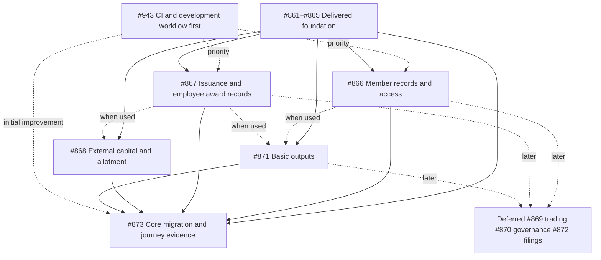

# Company-managed register implementation

[Accepted decision and plan](../../architecture/company-managed-registers.md) · [Owner decisions](../../decisions.md#company-managed-registers-and-one-product)

GitHub [#860](https://github.com/Ledova/ledova/issues/860) is the working
backlog for the one-registry-product transition; #861 retired the product
modes. This folder holds one short guide per delivered increment: what the
company or participant does, what is recorded, the API family and the
increment's own boundaries. Who may prepare, approve, apply and reject is stated
once in the [owner's authority rules](../../decisions.md#company-run-register-authority-and-evidence);
the uncertain-reply rule is stated once under
[company decisions and signer authority](../../architecture/outgoing-signing.md#company-decisions-and-signer-authority),
and each family's unsigned holds and recovery after authority loss in its own
[outgoing signing](../../architecture/outgoing-signing.md) section. The guides
link those rules rather than restating them. The
[9 October priority](../../decisions.md#essential-registry-and-development-workflow-priority)
puts [#943](https://github.com/Ledova/ledova/issues/943) first, then the
essential register below; new integrated AUD payments, trading, advanced
governance and filings are deferred.

## Delivered increments

| Issue                                               | Increment                                                                                                      | Guide                                                                                                       | PR                                                                                                   |
| --------------------------------------------------- | -------------------------------------------------------------------------------------------------------------- | ----------------------------------------------------------------------------------------------------------- | ---------------------------------------------------------------------------------------------------- |
| [#862](https://github.com/Ledova/ledova/issues/862) | Authority requests, admission, team invitations, revocation, legacy-owner upgrade; company information         | [authority-requests.md](authority-requests.md), [company-information.md](company-information.md)            | [#911](https://github.com/Ledova/ledova/pull/911) at `13684719c5245f1d61809d46e37a904f833e1c6d`  |
| [#863](https://github.com/Ledova/ledova/issues/863) | Administrator activation                                                                                       | [company-activation.md](company-activation.md)                                                              | [#913](https://github.com/Ledova/ledova/pull/913), [#914](https://github.com/Ledova/ledova/pull/914) |
| #863                                                | Eligibility records and the consumer cutover                                                                   | [company-eligibility.md](company-eligibility.md)                                                            | [#915](https://github.com/Ledova/ledova/pull/915), [#917](https://github.com/Ledova/ledova/pull/917) |
| [#864](https://github.com/Ledova/ledova/issues/864) | Register reads, imports, corrections, discrepancy acknowledgement, chain openings, particulars and wallet links | [Register foundation](../../operations/register-foundation.md)                                              | through [#936](https://github.com/Ledova/ledova/pull/936)                                            |
| [#865](https://github.com/Ledova/ledova/issues/865) | Non-paid register grants; non-paid register transfers and cessation history                                    | [register-grants.md](register-grants.md), [register-transfers.md](register-transfers.md)                    | [#937](https://github.com/Ledova/ledova/pull/937), [#938](https://github.com/Ledova/ledova/pull/938) |
| [#867](https://github.com/Ledova/ledova/issues/867) | Empty share-class deployment                                                                                   | [company-deployments.md](company-deployments.md)                                                            | [#941](https://github.com/Ledova/ledova/pull/941)                                                    |
| #867                                                | Wallet nominations and company wallet approvals                                                                | [company-wallet-approvals.md](company-wallet-approvals.md)                                                  | [#942](https://github.com/Ledova/ledova/pull/942)                                                    |
| #867                                                | Non-paid chain grants                                                                                          | [company-register-issues.md](company-register-issues.md)                                                    | [#944](https://github.com/Ledova/ledova/pull/944)                                                    |
| #867                                                | Capital increases                                                                                              | [company-capital-increases.md](company-capital-increases.md)                                                | [#948](https://github.com/Ledova/ledova/pull/948)                                                    |
| #867                                                | Pause and unpause                                                                                              | [company-pause-changes.md](company-pause-changes.md)                                                        | [#950](https://github.com/Ledova/ledova/pull/950)                                                    |
| #867                                                | Paid issues from recorded PAID subscriptions                                                                   | [company-paid-issues.md](company-paid-issues.md)                                                            | [#951](https://github.com/Ledova/ledova/pull/951)                                                    |
| [#866](https://github.com/Ledova/ledova/issues/866) | Own Profile name and residential address                                                                       | [member-profile.md](member-profile.md)                                                                      | [#953](https://github.com/Ledova/ledova/pull/953)                                                    |
| [#871](https://github.com/Ledova/ledova/issues/871) | Company inspection copies                                                                                      | [company-inspection-copies.md](company-inspection-copies.md)                                                | [#954](https://github.com/Ledova/ledova/pull/954)                                                    |

Two guides describe non-paid grants: company-register-issues.md covers
**on-chain** grants minted on a deployed class, and register-grants.md covers
**off-chain** grants entered in an imported register with no contract.

## Remaining scope

| Issue                                               | Remaining                                                                                                                                                                                                      | Current prerequisites                                                                                                                                    |
| --------------------------------------------------- | -------------------------------------------------------------------------------------------------------------------------------------------------------------------------------------------------------------- | -------------------------------------------------------------------------------------------------------------------------------------------------------- |
| [#866](https://github.com/Ledova/ledova/issues/866) | Account/member association, permitted own records, company-reviewed particulars requests and certificate request status                                                                                        | #862, #864 and #865 delivered; the invitation/binding policy is an owner decision                                                                        |
| [#867](https://github.com/Ledova/ledova/issues/867) | Employee award and vesting records: promised entitlement, recorded vesting events, shares issued through the existing grant path                                                                               | #862–#865 delivered; the [10 October decision](../../decisions.md#first-scopes-for-employee-awards-and-external-capital) fixes the model                 |
| [#868](https://github.com/Ledova/ledova/issues/868) | External investor capital and fully paid, company-approved allotments, walletless allowed; no collection, provider or refund work                                                                              | #862–#865 delivered; #866's association only where member access is used; the same 10 October decision fixes the first scope                            |
| [#871](https://github.com/Ledova/ledova/issues/871) | Certificates, company-pack provenance and permitted member fulfilment                                                                                                                                          | #862, #864 and #865 delivered; member fulfilment needs #866's association; no #869/#870 blocker                                                          |
| [#873](https://github.com/Ledova/ledova/issues/873) | Preserved upgrades and the essential company/member web/mobile journey                                                                                                                                         | #943's initial improvement and the essential #866, #867, #868 and #871 increments; no #869/#870/#872 blocker                                             |
| Deferred                                            | [#869](https://github.com/Ledova/ledova/issues/869) trading and settlement, [#870](https://github.com/Ledova/ledova/issues/870) advanced governance, [#872](https://github.com/Ledova/ledova/issues/872) filings | Scheduled by the owner; no essential increment waits for them                                                                                            |

## Dependency flow

## Ownership boundaries

#866 owns the single account/member association and permitted own-record UI;
#867 employee award and issuance records; #868 external capital and
company-approved allotment; #871 basic outputs; #873 the essential journey
evidence; #869, #870 and #872 trading, advanced governance and filings. Company
mandates and required approvals remain separate from finance receipts,
participant signatures and technical execution: a payment does not authorise an
issue, a generated filing draft does not establish lodgement, and any later
on-chain mirror preserves the recorded supply rather than issuing twice.

## History

The [3 October documentation audit](documentation-audit.md) records the
baseline; the [one-product decision](../../decisions.md#company-managed-registers-and-one-product)
and [representative verification](../../decisions.md#company-representative-verification)
are in decisions.md. Closed [#645](https://github.com/Ledova/ledova/issues/645)
and its phase tickets delivered the earlier foundation, closed
[#846](https://github.com/Ledova/ledova/issues/846) the synthetic fixtures, and
open [#624](https://github.com/Ledova/ledova/issues/624) keeps the separate
physical-device/live release acceptance. The earlier staff-assisted
screenshots, PDF, gallery and embedded artifact are preserved as dated evidence.
