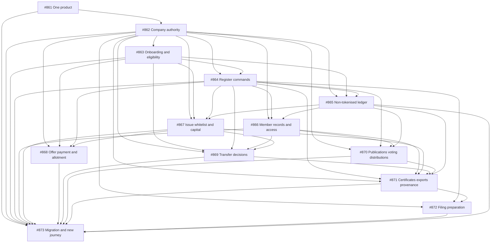

# Company-managed register implementation

[Accepted decision and plan](../../architecture/company-managed-registers.md) · [Documentation audit](documentation-audit.md)

The accepted direction is one registry product. Companies administer their own
share registers; investors, shareholders and employees interact directly with
companies. Ledova provides infrastructure, workflows and bounded automation.
Private hosting uses the same product and authority model.

The [GitHub programme #860](https://github.com/Ledova/ledova/issues/860) owns the
transition and its 13 implementation issues below. GitHub is the working backlog;
this folder records scope, sequencing and documentation traceability. These are
planned changes except phase 1: product-mode retirement is delivered by #861.
The initial #862 increments provide [unverified authority requests and withdrawal](authority-requests.md)
in both clients, retaining evidence and history. Company appointments and the
dependent register workflows remain
to be implemented; submitting evidence grants no authority.

The owner selected
[ASIC officeholder matching and in-app delegation](../../architecture/company-managed-registers.md#representative-verification)
on 4 October 2026 (Australia/Sydney). The data provider, account and sandbox
credentials remain outstanding; genuine result/proof integration must precede
effective admission. This decision does not complete #862 or its downstream
dependencies.

The documentation audit covers all 73 Markdown documents tracked at its baseline
plus the accepted plan: 74 documents, 46 updated and 28 retained as aligned
technical contracts, historical evidence or a truthful runtime-generated output.
This index and the audit report are additional reviewed documents.

## Delivery tracking

Follow the accepted six phases. Each issue includes concrete scope, completion
checks and code starting points; dependencies below are delivery prerequisites.
Each increment owns its meaningful verification rather than deferring it to the
final journey. Some output work may be delivered incrementally once its required
inputs are ready, without reducing the final issue's scope.

| Phase | Issue | Depends on |
| --- | --- | --- |
| 1 | [#861 Remove Registry and Single-issuer product modes](https://github.com/Ledova/ledova/issues/861) | None |
| 2 | [#862 Add company appointments, capabilities, invitations and revocation](https://github.com/Ledova/ledova/issues/862) | [#861](https://github.com/Ledova/ledova/issues/861) |
| 3 | [#863 Make company activation and participant eligibility evidenced self-service workflows](https://github.com/Ledova/ledova/issues/863) | [#862](https://github.com/Ledova/ledova/issues/862) |
| 3 | [#864 Provide company register openings, imports, links, corrections and reconciliation tools](https://github.com/Ledova/ledova/issues/864) | [#862](https://github.com/Ledova/ledova/issues/862), [#863](https://github.com/Ledova/ledova/issues/863) |
| 3 | [#865 Support company-managed non-tokenised register issues, transfers and member administration](https://github.com/Ledova/ledova/issues/865) | [#862](https://github.com/Ledova/ledova/issues/862), [#863](https://github.com/Ledova/ledova/issues/863), [#864](https://github.com/Ledova/ledova/issues/864) |
| 3 | [#866 Let shareholders and employees manage their particulars and access their own records](https://github.com/Ledova/ledova/issues/866) | [#862](https://github.com/Ledova/ledova/issues/862), [#864](https://github.com/Ledova/ledova/issues/864), [#865](https://github.com/Ledova/ledova/issues/865) |
| 4 | [#867 Authorise share issuance, company wallet approvals and capital actions through company workflows](https://github.com/Ledova/ledova/issues/867) | [#862](https://github.com/Ledova/ledova/issues/862), [#863](https://github.com/Ledova/ledova/issues/863), [#864](https://github.com/Ledova/ledova/issues/864), [#865](https://github.com/Ledova/ledova/issues/865) |
| 4 | [#868 Give companies offering decisions, subscription payments, refunds and allotment workflows](https://github.com/Ledova/ledova/issues/868) | [#862](https://github.com/Ledova/ledova/issues/862), [#863](https://github.com/Ledova/ledova/issues/863), [#864](https://github.com/Ledova/ledova/issues/864), [#867](https://github.com/Ledova/ledova/issues/867) |
| 5 | [#869 Provide company and shareholder transfer decisions with separate settlement and register states](https://github.com/Ledova/ledova/issues/869) | [#862](https://github.com/Ledova/ledova/issues/862), [#863](https://github.com/Ledova/ledova/issues/863), [#864](https://github.com/Ledova/ledova/issues/864), [#866](https://github.com/Ledova/ledova/issues/866), [#867](https://github.com/Ledova/ledova/issues/867) |
| 5 | [#870 Let companies publish member documents, resolutions and distributions](https://github.com/Ledova/ledova/issues/870) | [#862](https://github.com/Ledova/ledova/issues/862), [#864](https://github.com/Ledova/ledova/issues/864), [#866](https://github.com/Ledova/ledova/issues/866), [#865](https://github.com/Ledova/ledova/issues/865) |
| 5 | [#871 Provide company certificates, inspection copies, exports and truthful register provenance](https://github.com/Ledova/ledova/issues/871) | [#862](https://github.com/Ledova/ledova/issues/862), [#864](https://github.com/Ledova/ledova/issues/864), [#866](https://github.com/Ledova/ledova/issues/866), [#867](https://github.com/Ledova/ledova/issues/867), [#869](https://github.com/Ledova/ledova/issues/869), [#870](https://github.com/Ledova/ledova/issues/870), [#865](https://github.com/Ledova/ledova/issues/865) |
| 6 | [#872 Add checked company filing preparation and submission outcome tracking](https://github.com/Ledova/ledova/issues/872) | [#862](https://github.com/Ledova/ledova/issues/862), [#864](https://github.com/Ledova/ledova/issues/864), [#871](https://github.com/Ledova/ledova/issues/871) |
| 6 | [#873 Verify preserved migrations and record the complete company-managed web/mobile journey](https://github.com/Ledova/ledova/issues/873) | [#861](https://github.com/Ledova/ledova/issues/861), [#862](https://github.com/Ledova/ledova/issues/862), [#863](https://github.com/Ledova/ledova/issues/863), [#864](https://github.com/Ledova/ledova/issues/864), [#866](https://github.com/Ledova/ledova/issues/866), [#867](https://github.com/Ledova/ledova/issues/867), [#868](https://github.com/Ledova/ledova/issues/868), [#869](https://github.com/Ledova/ledova/issues/869), [#870](https://github.com/Ledova/ledova/issues/870), [#871](https://github.com/Ledova/ledova/issues/871), [#872](https://github.com/Ledova/ledova/issues/872), [#865](https://github.com/Ledova/ledova/issues/865) |

## Dependency flow

## Ownership boundaries

The register-command issue owns existing opening/import/link/correction and
reconciliation commands. The non-tokenised issue owns genuine ledger effects,
company command UI and chain-independent identity/roll/output inputs. The member
issue owns claim/invitation/request/own-record UI; governance owns publication,
voting and distribution UI for tokenised and non-tokenised registers alike.

Company mandates and required approvals remain separate from finance receipts,
participant signatures and technical execution. A payment does not authorise
an issue. A generated filing draft does not establish lodgement. Any later
on-chain mirror preserves the already recorded supply rather than issuing twice.

## Existing work and evidence

The closed [earlier programme #645](https://github.com/Ledova/ledova/issues/645)
and its phase tickets record the delivered foundation. Closed
[#846](https://github.com/Ledova/ledova/issues/846) delivered synthetic development
fixtures; open [#624](https://github.com/Ledova/ledova/issues/624) owns separate
physical-device/live-operation release acceptance. Their work does not replace
fresh company-authority verification.

Preserve the earlier staff-assisted screenshots, PDF, gallery and embedded
artifact. The new acceptance issue owns a separate step-by-step company/member
recording, Markdown guide and Mermaid diagrams after the workflows actually
work. All increments follow [testing guidance](../../development/testing.md)
and [gate requirements](../../development/gates.md).
