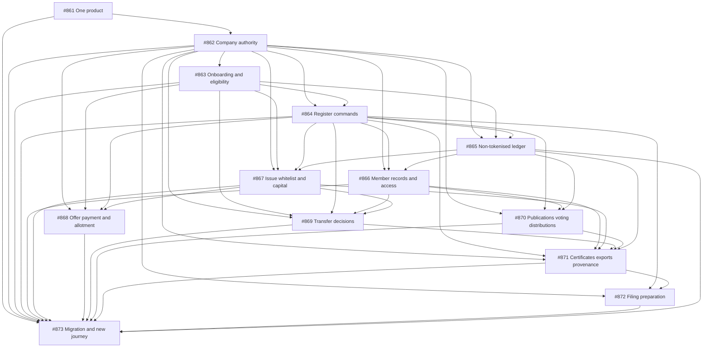

# Company-managed register implementation

[Accepted decision and plan](../../architecture/company-managed-registers.md) · [Documentation audit](documentation-audit.md)

The accepted direction is one registry product. Companies administer their own
share registers; investors, shareholders and employees interact directly with
companies. Ledova provides infrastructure, workflows and bounded automation.
Private hosting uses the same product and authority model.

The [GitHub programme #860](https://github.com/Ledova/ledova/issues/860) owns the
transition and its 13 implementation issues below. GitHub is the working backlog;
this folder records scope, sequencing and documentation traceability. Phases 1
and 2 are delivered: #861 retired product modes and #862 established company
authority, with its final foundation delivered by [PR #911](https://github.com/Ledova/ledova/pull/911)
at commit `13684719c5245f1d61809d46e37a904f833e1c6d`. The [company activation increment](company-activation.md) implements the activation
part of #863, delivered through [PR #913](https://github.com/Ledova/ledova/pull/913).
[PR #914](https://github.com/Ledova/ledova/pull/914) aligns the authority lock prefixes.
The [eligibility records and API foundation](company-eligibility.md) landed through
[PR #915](https://github.com/Ledova/ledova/pull/915).
[PR #917](https://github.com/Ledova/ledova/pull/917) implements the coherent
consumer/client cutover using current exact-company decisions, separate account
readiness and authenticated market streams. It preserves private source history,
restricts new eligibility-loss instructions to removing wallet approval and retires
global staff classification authority. Browser/mobile forms expose preview,
confirmation and retained history with personal prepare/approve queues; uncertain
commands can be replayed within the running session. The [eligibility guide](company-eligibility.md)
records the admission, recovery and verification boundaries.
The owner's [5 October amendment](https://github.com/Ledova/ledova/issues/860#issuecomment-5988858576)
let #864 start before #863 closed, except member-wallet links, which waited for
#863. #864's first increment delivers register reads by appointment, its second
company-run imports, its third company-run corrections, its fourth company
acknowledgement of reconciliation discrepancies, its fifth company-run openings
from the chain, its sixth company-run changes to a member's particulars and its
seventh company-run member-wallet links, each through the API and both clients.
#864 is complete through [PR #936](https://github.com/Ledova/ledova/pull/936).
The first #865 increment delivers [non-paid register grants](register-grants.md)
to new or existing walletless members through current company appointments,
retained evidence and a genuine ISSUE entry. The second adds [direct non-paid
transfers](register-transfers.md), returning/new recipients and attributable
cessation history with genuine roll/certificate inputs. The first #867 increment
implements [company-authorised empty deployments](company-deployments.md), with
retained approval and original execution recovery. The second increment implements
[wallet nominations and company instructions](company-wallet-approvals.md),
retaining genuine possession proof, exact company approval and original journal
execution. Company issuance, capital and pause conversion remain later #867
increments.
#866 and #868–#873 remain dependency-ordered and own the later company/member,
offering and register workflows.
The #862 lifecycle provides [authority requests, self-declaration admission and
self-revocation](authority-requests.md) in both clients, retaining private
evidence and history. Initial scoped appointments require the existing configured
identity and ABR checks. Both clients and the API support invitations, scoped team
delegation, appointment history, administrator team reads and retained revocation.
The legacy-owner upgrade records retained owner provenance and administrator
appointments without declarations or approvals. Current administrators and draft
owners can manage bounded [company information and documents](company-information.md)
through both clients and the guarded API. Personal `admin` for the exact company
controls administrative changes and private company documents; the owner's
bounded draft setup exception ends permanently once initial or legacy-owner
appointment history exists. Verified isolation, revocation, expiry and concurrent
retry controls preserve private evidence and retained history. Ownership,
shareholding and platform staff access supply no company appointment. Dependent
register workflows retain their existing conditions until their owning issues
replace them; submitting evidence alone grants no authority.

The owner's [4 October 2026 self-declaration decision](https://github.com/Ledova/ledova/issues/862#issuecomment-5973451112)
and [accepted refinements](https://github.com/Ledova/ledova/issues/862#issuecomment-5973465105)
set the accepted [representative authority route](../../architecture/company-managed-registers.md#representative-verification).
The company supplies its information and the representative declares their
authorisation. Company details are shown as provided by the company, never
verified by Ledova; the terms assign responsibility to the company. Companies
remain responsible for their information, ASIC filings and legal obligations.
Company administrators change only through existing company administrators or
court/regulator direction; normal own-account recovery is separate.

The earlier [ASIC officeholder route](https://github.com/Ledova/ledova/issues/862#issuecomment-5970984155)
and [InfoTrack broker choice](https://github.com/Ledova/ledova/issues/862#issuecomment-5971158175)
are superseded history. No ASIC search, broker, uploaded ASIC extract or InfoTrack
agreement is required; those prerequisites no longer block #862–#873. Existing
representative identity/ABR checks, memberships, capabilities, invitations,
in-app delegation, revocation, isolation and signed-transaction safeguards remain.
No new anti-impersonation verification is planned without an identified legal
duty on Ledova, which must be cited and raised with the owner before any check is
built. The delivered #862 foundation completes phase 2. The activation increment uses
that authority with a distinct declaration and configured activation check. It
does not approve an issue, payment, offering or participant eligibility decision.
The dependencies below remain prerequisites.

The documentation audit covers all 73 Markdown documents tracked at its baseline
plus the accepted plan: 74 documents, 46 updated and 28 retained as aligned
technical contracts, historical evidence or a truthful runtime-generated output.
This index and the audit report are additional reviewed documents.

The owner's [5 October product clarification](../../decisions.md#registry-priority-crypto-on-ramp-and-aud-payments)
prioritises the private-company register and share issuance, management,
transfer and purchase. Optional crypto on-ramp purchases are investor-only;
companies must not use that integration to buy cryptocurrency. Its current
investing-account and provider-lifetime guards are tracked separately in
[#920](https://github.com/Ledova/ledova/issues/920), without changing programme
dependencies or agent ownership. AUD is a valid share-payment requirement,
distinct from AUD pricing and stablecoin settlement. #868 owns primary payment
work and #869 the secondary path; payment rails/provider, collection,
verification, reconciliation, refund and settlement choices remain undecided.
Core share journeys must not require an on-ramp purchase.

## Delivery tracking

Follow the accepted six phases. Each issue includes concrete scope, completion
checks and code starting points; dependencies below are delivery prerequisites.
Each increment owns its meaningful verification rather than deferring it to the
final journey. Some output work may be delivered incrementally once its required
inputs are ready, without reducing the final issue's scope.

| Phase | Issue                                                                                                                                                | Depends on                                                                                                                                                                                                                                                                                                                                                                                                                                                                                                                                                                                                                                                 |
| ----- | ---------------------------------------------------------------------------------------------------------------------------------------------------- | ---------------------------------------------------------------------------------------------------------------------------------------------------------------------------------------------------------------------------------------------------------------------------------------------------------------------------------------------------------------------------------------------------------------------------------------------------------------------------------------------------------------------------------------------------------------------------------------------------------------------------------------------------------- |
| 1     | [#861 Remove Registry and Single-issuer product modes](https://github.com/Ledova/ledova/issues/861)                                                  | None                                                                                                                                                                                                                                                                                                                                                                                                                                                                                                                                                                                                                                                       |
| 2     | [#862 Add company appointments, capabilities, invitations and revocation](https://github.com/Ledova/ledova/issues/862)                               | [#861](https://github.com/Ledova/ledova/issues/861)                                                                                                                                                                                                                                                                                                                                                                                                                                                                                                                                                                                                        |
| 3     | [#863 Make company activation and participant eligibility evidenced self-service workflows](https://github.com/Ledova/ledova/issues/863)             | [#862](https://github.com/Ledova/ledova/issues/862)                                                                                                                                                                                                                                                                                                                                                                                                                                                                                                                                                                                                        |
| 3     | [#864 Provide company register openings, imports, links, corrections and reconciliation tools](https://github.com/Ledova/ledova/issues/864)          | [#862](https://github.com/Ledova/ledova/issues/862), [#863](https://github.com/Ledova/ledova/issues/863)                                                                                                                                                                                                                                                                                                                                                                                                                                                                                                                                                   |
| 3     | [#865 Support company-managed non-tokenised register issues, transfers and member administration](https://github.com/Ledova/ledova/issues/865)       | [#862](https://github.com/Ledova/ledova/issues/862), [#863](https://github.com/Ledova/ledova/issues/863), [#864](https://github.com/Ledova/ledova/issues/864)                                                                                                                                                                                                                                                                                                                                                                                                                                                                                              |
| 3     | [#866 Let shareholders and employees manage their particulars and access their own records](https://github.com/Ledova/ledova/issues/866)             | [#862](https://github.com/Ledova/ledova/issues/862), [#864](https://github.com/Ledova/ledova/issues/864), [#865](https://github.com/Ledova/ledova/issues/865)                                                                                                                                                                                                                                                                                                                                                                                                                                                                                              |
| 4     | [#867 Authorise share issuance, company wallet approvals and capital actions through company workflows](https://github.com/Ledova/ledova/issues/867) | [#862](https://github.com/Ledova/ledova/issues/862), [#863](https://github.com/Ledova/ledova/issues/863), [#864](https://github.com/Ledova/ledova/issues/864), [#865](https://github.com/Ledova/ledova/issues/865)                                                                                                                                                                                                                                                                                                                                                                                                                                         |
| 4     | [#868 Give companies offering decisions, subscription payments, refunds and allotment workflows](https://github.com/Ledova/ledova/issues/868)        | [#862](https://github.com/Ledova/ledova/issues/862), [#863](https://github.com/Ledova/ledova/issues/863), [#864](https://github.com/Ledova/ledova/issues/864), [#867](https://github.com/Ledova/ledova/issues/867)                                                                                                                                                                                                                                                                                                                                                                                                                                         |
| 5     | [#869 Provide company and shareholder transfer decisions with separate settlement and register states](https://github.com/Ledova/ledova/issues/869)  | [#862](https://github.com/Ledova/ledova/issues/862), [#863](https://github.com/Ledova/ledova/issues/863), [#864](https://github.com/Ledova/ledova/issues/864), [#866](https://github.com/Ledova/ledova/issues/866), [#867](https://github.com/Ledova/ledova/issues/867)                                                                                                                                                                                                                                                                                                                                                                                    |
| 5     | [#870 Let companies publish member documents, resolutions and distributions](https://github.com/Ledova/ledova/issues/870)                            | [#862](https://github.com/Ledova/ledova/issues/862), [#864](https://github.com/Ledova/ledova/issues/864), [#866](https://github.com/Ledova/ledova/issues/866), [#865](https://github.com/Ledova/ledova/issues/865)                                                                                                                                                                                                                                                                                                                                                                                                                                         |
| 5     | [#871 Provide company certificates, inspection copies, exports and truthful register provenance](https://github.com/Ledova/ledova/issues/871)        | [#862](https://github.com/Ledova/ledova/issues/862), [#864](https://github.com/Ledova/ledova/issues/864), [#866](https://github.com/Ledova/ledova/issues/866), [#867](https://github.com/Ledova/ledova/issues/867), [#869](https://github.com/Ledova/ledova/issues/869), [#870](https://github.com/Ledova/ledova/issues/870), [#865](https://github.com/Ledova/ledova/issues/865)                                                                                                                                                                                                                                                                          |
| 6     | [#872 Add checked company filing preparation and submission outcome tracking](https://github.com/Ledova/ledova/issues/872)                           | [#862](https://github.com/Ledova/ledova/issues/862), [#864](https://github.com/Ledova/ledova/issues/864), [#871](https://github.com/Ledova/ledova/issues/871)                                                                                                                                                                                                                                                                                                                                                                                                                                                                                              |
| 6     | [#873 Verify preserved migrations and record the complete company-managed web/mobile journey](https://github.com/Ledova/ledova/issues/873)           | [#861](https://github.com/Ledova/ledova/issues/861), [#862](https://github.com/Ledova/ledova/issues/862), [#863](https://github.com/Ledova/ledova/issues/863), [#864](https://github.com/Ledova/ledova/issues/864), [#866](https://github.com/Ledova/ledova/issues/866), [#867](https://github.com/Ledova/ledova/issues/867), [#868](https://github.com/Ledova/ledova/issues/868), [#869](https://github.com/Ledova/ledova/issues/869), [#870](https://github.com/Ledova/ledova/issues/870), [#871](https://github.com/Ledova/ledova/issues/871), [#872](https://github.com/Ledova/ledova/issues/872), [#865](https://github.com/Ledova/ledova/issues/865) |

## Dependency flow

## Ownership boundaries

The register-command issue owns existing opening/import/link/correction and
reconciliation commands. The non-tokenised issue owns genuine ledger effects,
company command UI and chain-independent identity/roll/output inputs. The member
issue owns claim/invitation/request/own-record UI; governance owns publication,
voting and distribution UI for tokenised and non-tokenised registers alike.

Company mandates and required approvals remain separate from finance receipts,
participant signatures and technical execution. A payment does not authorise
an issue. A generated filing draft does not establish lodgement. Any later
on-chain mirror preserves the already recorded supply rather than issuing twice.

## Existing work and evidence

The closed [earlier programme #645](https://github.com/Ledova/ledova/issues/645)
and its phase tickets record the delivered foundation. Closed
[#846](https://github.com/Ledova/ledova/issues/846) delivered synthetic development
fixtures; open [#624](https://github.com/Ledova/ledova/issues/624) owns separate
physical-device/live-operation release acceptance. Their work does not replace
fresh self-declaration admission and the company-managed workflows.

Preserve the earlier staff-assisted screenshots, PDF, gallery and embedded
artifact. The new acceptance issue owns a separate step-by-step company/member
recording, Markdown guide and Mermaid diagrams after the workflows actually
work. All increments follow [testing guidance](../../development/testing.md)
and [gate requirements](../../development/gates.md).
