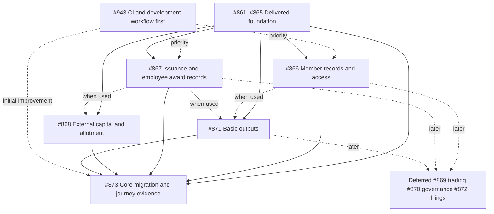

# Company-managed register implementation

[Accepted decision and plan](../../architecture/company-managed-registers.md) · [Documentation audit](documentation-audit.md)

The accepted direction is one registry product. Companies administer their own
share registers; investors, shareholders and employees interact directly with
companies. Ledova provides infrastructure, workflows and bounded automation.
Private hosting uses the same product and authority model.

The [GitHub programme #860](https://github.com/Ledova/ledova/issues/860) owns the
transition and the existing issues below. GitHub is the working backlog;
this folder records scope, sequencing and documentation traceability. Phases 1
and 2 are delivered: #861 retired product modes and #862 established company
authority, with its final foundation delivered by [PR #911](https://github.com/Ledova/ledova/pull/911)
at commit `13684719c5245f1d61809d46e37a904f833e1c6d`. The [company activation increment](company-activation.md) implements the activation
part of #863, delivered through [PR #913](https://github.com/Ledova/ledova/pull/913).
[PR #914](https://github.com/Ledova/ledova/pull/914) aligns the authority lock prefixes.
The [eligibility records and API foundation](company-eligibility.md) landed through
[PR #915](https://github.com/Ledova/ledova/pull/915).
[PR #917](https://github.com/Ledova/ledova/pull/917) implements the coherent
consumer/client cutover using current exact-company decisions, separate account
readiness and authenticated market streams. It preserves private source history,
restricts new eligibility-loss instructions to removing wallet approval and retires
global staff classification authority. Browser/mobile forms expose preview,
confirmation and retained history with personal prepare/approve queues; uncertain
commands can be replayed within the running session. The [eligibility guide](company-eligibility.md)
records the admission, recovery and verification boundaries.
The owner's [5 October amendment](https://github.com/Ledova/ledova/issues/860#issuecomment-5988858576)
let #864 start before #863 closed, except member-wallet links, which waited for
#863. #864's first increment delivers register reads by appointment, its second
company-run imports, its third company-run corrections, its fourth company
acknowledgement of reconciliation discrepancies, its fifth company-run openings
from the chain, its sixth company-run changes to a member's particulars and its
seventh company-run member-wallet links, each through the API and both clients.
#864 is complete through [PR #936](https://github.com/Ledova/ledova/pull/936).
The first #865 increment delivers [non-paid register grants](register-grants.md)
to new or existing walletless members through current company appointments,
retained evidence and a genuine ISSUE entry. The second adds [direct non-paid
transfers](register-transfers.md), returning/new recipients and attributable
cessation history with genuine roll/certificate inputs. The first #867 increment
implements [company-authorised empty deployments](company-deployments.md), with
retained approval and original execution recovery. The second increment implements
[wallet nominations and company instructions](company-wallet-approvals.md),
retaining genuine possession proof, exact company approval and original journal
execution. The third increment implements
[non-paid on-chain grants](company-register-issues.md), with exact company
instructions and a first-member LINK bootstrap. The fourth increment's
[capital guide](company-capital-increases.md) describes implemented company decisions
and original cap-only execution. The fifth increment's
[pause/unpause guide](company-pause-changes.md) describes implemented company decisions,
genuine observations and original transaction recovery.
Paid issuance remains a later #867 increment.
#866 and #868–#873 retain the revised core/deferred scopes and dependencies
below. Their company/member, allotment and register authority remains separate.
The #862 lifecycle provides [authority requests, self-declaration admission and
self-revocation](authority-requests.md) in both clients, retaining private
evidence and history. Initial scoped appointments require the existing configured
identity and ABR checks. Both clients and the API support invitations, scoped team
delegation, appointment history, administrator team reads and retained revocation.
The legacy-owner upgrade records retained owner provenance and administrator
appointments without declarations or approvals. Current administrators and draft
owners can manage bounded [company information and documents](company-information.md)
through both clients and the guarded API. Personal `admin` for the exact company
controls administrative changes and private company documents; the owner's
bounded draft setup exception ends permanently once initial or legacy-owner
appointment history exists. Verified isolation, revocation, expiry and concurrent
retry controls preserve private evidence and retained history. Ownership,
shareholding and platform staff access supply no company appointment. Dependent
register workflows retain their existing conditions until their owning issues
replace them; submitting evidence alone grants no authority.

The owner's [4 October 2026 self-declaration decision](https://github.com/Ledova/ledova/issues/862#issuecomment-5973451112)
and [accepted refinements](https://github.com/Ledova/ledova/issues/862#issuecomment-5973465105)
set the accepted [representative authority route](../../architecture/company-managed-registers.md#representative-verification).
The company supplies its information and the representative declares their
authorisation. Company details are shown as provided by the company, never
verified by Ledova; the terms assign responsibility to the company. Companies
remain responsible for their information, ASIC filings and legal obligations.
Company administrators change only through existing company administrators or
court/regulator direction; normal own-account recovery is separate.

The earlier [ASIC officeholder route](https://github.com/Ledova/ledova/issues/862#issuecomment-5970984155)
and [InfoTrack broker choice](https://github.com/Ledova/ledova/issues/862#issuecomment-5971158175)
are superseded history. No ASIC search, broker, uploaded ASIC extract or InfoTrack
agreement is required; those prerequisites no longer block #862–#873. Existing
representative identity/ABR checks, memberships, capabilities, invitations,
in-app delegation, revocation, isolation and signed-transaction safeguards remain.
No new anti-impersonation verification is planned without an identified legal
duty on Ledova, which must be cited and raised with the owner before any check is
built. The delivered #862 foundation completes phase 2. The activation increment uses
that authority with a distinct declaration and configured activation check. It
does not approve an issue, payment, offering or participant eligibility decision.
The dependencies below remain prerequisites.

The documentation audit covers all 73 Markdown documents tracked at its baseline
plus the accepted plan: 74 documents, 46 updated and 28 retained as aligned
technical contracts, historical evidence or a truthful runtime-generated output.
This index and the audit report are additional reviewed documents.

The owner's [9 October priority amendment](../../decisions.md#essential-registry-and-development-workflow-priority)
puts development-workflow simplification (#943) first. The essential register
then supports non-paid employee awards and vesting records, externally arranged
investor capital and company-approved allotments, accurate ownership, member
access and basic outputs. Current grants are outright; structured vesting and
new off-chain investor allotments are not delivered. No legal/tax rule engine,
option-exercise scheme or #866 invitation/access policy is selected.

New integrated AUD payments, trading, advanced governance and filings are
deferred. Keep useful existing chain/payment functionality, history and recovery.
AUD capital evidence can be recorded without claiming Ledova collected funds;
future payment mechanics remain owner decisions. Investor-only optional crypto
purchases retain #920's guards; companies cannot use the on-ramp to buy crypto.

## Delivery tracking

The [current owner policy on #860](https://github.com/Ledova/ledova/issues/860#issuecomment-6078277168)
and live issue claims supersede the original six-phase all-workflow sequence.
Use these existing issues; every increment owns its meaningful verification.
#943 no longer waits for #867. Basic outputs and core acceptance no longer wait
for deferred #869, #870 or #872. No deferred capability is implicitly delivered.

| Priority             | Existing issue and scope                                                                                          | Prerequisites                                                                                                            |
| -------------------- | ----------------------------------------------------------------------------------------------------------------- | ------------------------------------------------------------------------------------------------------------------------ |
| First                | [#943 Development workflow and measured CI simplification](https://github.com/Ledova/ledova/issues/943)           | Ready independently of #867; first timing increment does not deliver all proposed routing/tiers                          |
| Delivered foundation | [#861 One registry product](https://github.com/Ledova/ledova/issues/861)                                          | None                                                                                                                     |
| Delivered foundation | [#862 Company authority](https://github.com/Ledova/ledova/issues/862)                                             | #861                                                                                                                     |
| Delivered foundation | [#863 Activation and participant eligibility](https://github.com/Ledova/ledova/issues/863)                        | #862                                                                                                                     |
| Delivered foundation | [#864 Register commands](https://github.com/Ledova/ledova/issues/864)                                             | #862, #863                                                                                                               |
| Delivered foundation | [#865 Non-tokenised grants, transfers and member history](https://github.com/Ledova/ledova/issues/865)            | #862, #863, #864                                                                                                         |
| Essential            | [#866 Member particulars and own-record access](https://github.com/Ledova/ledova/issues/866)                      | #862, #864, #865; single account association/access policy remains to be decided                                         |
| Essential            | [#867 Authorised issuance and employee award/vesting records](https://github.com/Ledova/ledova/issues/867)        | #862, #863, #864, #865; preserve current delivered chain increments and claimed work                                     |
| Essential            | [#868 External investor capital and company-approved allotment](https://github.com/Ledova/ledova/issues/868)      | Delivered #862–#865; specific #866 access or #867 execution inputs only when used; integrated payment expansion deferred |
| Essential            | [#871 Basic certificates, inspection copies, exports and provenance](https://github.com/Ledova/ledova/issues/871) | Delivered #862, #864, #865; specific #866 member-access or #867 issuance inputs only when used; no #869/#870 blocker     |
| Essential            | [#873 Preserved migrations and core web/mobile journey](https://github.com/Ledova/ledova/issues/873)              | Initial #943 improvement, delivered #861–#865 and essential #866/#867/#868/#871 increments; no #869/#870/#872 blocker    |
| Deferred             | [#869 Later transfer decisions and market settlement](https://github.com/Ledova/ledova/issues/869)                | #862, #863, #864, #866, #867 when scheduled                                                                              |
| Deferred             | [#870 Advanced publications, resolutions and distributions](https://github.com/Ledova/ledova/issues/870)          | #862, #864, #865, #866 when scheduled                                                                                    |
| Deferred             | [#872 Filing preparation and submission outcomes](https://github.com/Ledova/ledova/issues/872)                    | #862, #864, #871 when scheduled                                                                                          |

## Dependency flow

## Ownership boundaries

The register-command issue owns existing opening/import/link/correction and
reconciliation commands. The non-tokenised issue owns genuine ledger effects,
company command UI and chain-independent identity/roll/output inputs. The member
issue owns the single account association and permitted particulars/own-record
UI; its access policy remains undecided. #867 owns supported employee award and
issuance records; #868 owns external capital and company-approved allotment.
#871 owns basic outputs and #873 the essential journey evidence. Advanced
governance, trading and filings remain with their deferred existing issues.

Company mandates and required approvals remain separate from finance receipts,
participant signatures and technical execution. A payment does not authorise
an issue. A generated filing draft does not establish lodgement. Any later
on-chain mirror preserves the already recorded supply rather than issuing twice.

## Existing work and evidence

The closed [earlier programme #645](https://github.com/Ledova/ledova/issues/645)
and its phase tickets record the delivered foundation. Closed
[#846](https://github.com/Ledova/ledova/issues/846) delivered synthetic development
fixtures; open [#624](https://github.com/Ledova/ledova/issues/624) owns separate
physical-device/live-operation release acceptance. Their work does not replace
fresh self-declaration admission and the company-managed workflows.

Preserve the earlier staff-assisted screenshots, PDF, gallery and embedded
artifact. The new acceptance issue owns a separate step-by-step company/member
recording, Markdown guide and Mermaid diagrams after the workflows actually
work. All increments follow [testing guidance](../../development/testing.md)
and [gate requirements](../../development/gates.md).
