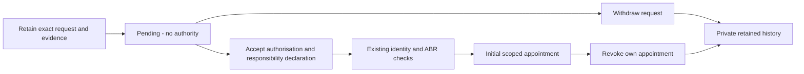

# Representative authority and company appointments

[Implementation index](README.md) · [Accepted plan](../../architecture/company-managed-registers.md)

[Issue #862](https://github.com/Ledova/ledova/issues/862) provides private authority
requests, withdrawal and initial self-declaration admission on web and mobile.
A pending request grants no authority. Admission records the representative's
declaration and an effective initial appointment for the exact company, personal
capabilities, delegatable scope and expiry. Company activation and register
decisions retain their current workflows; an appointment supplies no approval of
a share instruction, payment or director decision.

Company details are **provided by the company**. The existing ABR lookup checks
entity facts; it does not make Ledova responsible for company information or
establish the representative's mandate. Use synthetic people, companies and
evidence in this experimental implementation.

## Company user steps

1. Sign up, verify your account email and register a draft company. Complete the
   existing representative identity check when configured for issuers.
2. Open **Representative authority** from the company details screen on web or
   mobile. Select the draft company you own; selection is explicit when you have
   several companies.
3. Choose personal capabilities and, separately, capabilities you intend to
   delegate. Initial admission requires personal company administration. Set an
   expiry if required. Selecting scopes alone grants no authority.
4. Upload supporting PDF, PNG or JPEG through the existing checked upload flow.
   No ASIC extract is required. The file remains private and retained.
5. Submit the request. The platform freezes the company and representative
   identities, scopes, expiry and evidence bytes. Review the captured information.
6. Accept the displayed declaration and choose the admission action. Version
   `2026-10-04` records: “I am authorised to act for this company. The company is
   responsible for the company and share information it provides, its ASIC filings
   and legal obligations.” The existing configured identity and ABR checks must
   pass; missing or mismatched results leave the request pending. Admission does
   not activate the company.
7. Read the appointment's personal and delegatable capabilities, expiry and
   current status. Download the retained evidence from your request history.
8. Withdraw an unwanted pending request. After admission, choose **Revoke
   appointment** and review the permanent loss of this appointment's company
   authority. Cancel to keep it, or confirm permanent revocation; its original
   declaration and evidence remain available. Another initial self-declaration
   cannot restore the appointment. Revocation does not admit a replacement
   representative or reopen initial admission.

Team invitations, acceptance, appointment history, administrator team reads and
revocation are available on web and mobile and through the API below. The upgrade
records existing company owners as administrators under the legacy source below.
Company activation, register decisions and payments follow their owning issues in the
[dependency index](README.md#delivery-tracking).

## Company team on web and mobile

Open **Company team** from company details, web **Settings → Profile and security**
or the mobile drawer. The settings/drawer entry is available to investor-only
accounts too; a company tab is not required to accept an invitation or read your
appointments.

1. To invite someone, select the company and one of your current delegating
   appointments. Select personal permissions and onward delegation separately,
   within that appointment's recorded delegation scope. Granting company
   administration also requires a current personal administrator appointment for
   that company.
   Optional appointment expiry and invitation deadline are explicit.
2. Create the invitation and privately share its displayed one-time code. The
   code is shown in the current form and disappears when the form is replaced or
   your account or selected appointment changes. It is not available from history. An unchanged interrupted retry keeps
   its idempotency key; a confirmed retry can return the retained invitation with
   no retrievable code. Create another invitation if you did not retain the code.
3. To accept, enter the code and agree to the displayed authorisation and company
   responsibility declaration. Your own account, verified email and configured
   identity checks apply. Editing the code clears agreement; failed acceptance
   retains the input for a deliberate retry.
4. Read your appointment's actual source, scope, expiry and current status. Read
   invitations you issued and their recorded acceptance outcome. These histories
   retain expired and revoked records. Current company administrators can also
   read the selected company's bounded team name, email, scope and status.
5. Revoke your own appointment or, as a current company administrator, a selected
   team appointment. Confirm the permanent action in the web dialog or native
   mobile alert. Cancelled, reused or stale confirmations cannot submit a new
   effect; a failed or unconfirmed result requires fresh confirmation. An initial
   or legacy-owner appointment cannot be replaced through another bootstrap declaration.

Refresh failures hide unavailable authority and team results. Account changes
invalidate pending submissions and late receipts. Company details are attributed
to the company; team access does not expose another person's private declaration,
identity/financial evidence or bootstrap file.

## API and retained records

`/api/v1/company-authority/requests/` provides authenticated multipart submission
and paginated personal history. Detail and file actions resolve only the caller's
own request. Active accounts with verified email are required. New submissions
also require current ownership of the selected draft company. Public company
visibility, shareholder records and staff permissions do not widen this scope.

The server validates the upload and freezes raw and normalised identities,
file SHA256/size/type, requested scopes and expiry. It accepts no caller-supplied
verification result or representative account. Identical submission retries under
the same requester-scoped idempotency key return the retained request, including
after its company leaves draft or changes owner. Retries compare incoming bytes,
filename, MIME type and terms with the retained digest and current identities;
they do not rescan already retained evidence. New keys require upload validation
and current draft-company ownership. Changed inputs conflict.

`POST /api/v1/company-authority/requests/{uuid}/admit/` requires
`declaration_version: "2026-10-04"` and `accept_declaration: true`. The server
checks the exact retained request, live requester and configured identity result,
current draft-company ownership, unchanged captured identities and unexpired
scope. It runs the existing ABR adapter under a separate authority purpose and
checks its genuine result for that company and lifecycle revision before creating
an immutable initial appointment. A provider failure supplies no appointment.
Repeated admission returns the retained outcome. A company has only one initial
admission; expiry or revocation does not permit a new bootstrap.

`POST /api/v1/company-authority/requests/{uuid}/withdraw/` accepts an empty body
and records immutable requester withdrawal. Admission and withdrawal share the
request lock. Whichever commits first excludes the other outcome.

`POST /api/v1/company-authority/requests/{uuid}/revoke/` accepts an empty body
and records immutable self-revocation of the admitted appointment. Repeated
revocation returns its original outcome. Reads and files remain available.
Current-authority checks reject revoked or expired appointments and inactive
accounts. Existing signed-transaction recovery is unaffected; no new chain or
register command is introduced here.

## Team invitation API

The following authenticated operations supplement the initial-request workflow:

| Operation | Scope and outcome |
| --- | --- |
| `GET /api/v1/company-authority/invitations/` | Paginated history of invitations issued by the caller |
| `POST /api/v1/company-authority/invitations/` | Issue an invitation from the caller's selected current company appointment |
| `POST /api/v1/company-authority/invitations/accept/` | Accept a code with the exact current declaration, creating one appointment |
| `GET /api/v1/company-authority/appointments/`                     | Paginated history of the caller's own initial, invited and legacy-owner appointments                         |
| `GET /api/v1/company-authority/appointments/team/?company={uuid}` | Read that company's team as a current company administrator |
| `POST /api/v1/company-authority/appointments/{uuid}/revoke/` | Permanently revoke one's own appointment or, as a current administrator, another appointment in that company |

Issuance requires `company`, `inviter_appointment`, a caller-scoped
`idempotency_key`, and personal `capabilities`. Optional
`delegatable_capabilities` remain separate from personal authority. The union of
offered personal and delegatable capabilities must be within the selected
appointment's current delegatable scope. A caller may delegate a capability they
do not personally hold; this does not grant it to the caller. Granting or
delegating `admin` also requires a current personal administrator appointment for
that company. A platform staff role, company ownership or shareholder record
supplies neither appointment nor access to its team.

`acceptance_deadline` defaults to seven days and must be within thirty days.
Optional `appointment_expires_at` must be in the future. The issuance response
returns a random code once, with `Cache-Control: private, no-store`. The database
retains only its SHA256. Identical issuance retries return the original invitation
and `code: null`; changed company, source, scopes or explicit dates conflict. Send
the code directly to the intended recipient; it authorises the first eligible
accepting account. No email-delivery service or code-bearing URL is introduced.

Acceptance requires `code`, `declaration_version: "2026-10-04"` and
`accept_declaration: true`. It checks the actual accepting account and profile,
the configured issuer identity requirement, the invitation deadline and current
inviter authority before creating the exact offered appointment. An inviter cannot
accept their own invitation. A new acceptance also refuses an existing unrevoked,
unexpired appointment for the same person and company, even if that appointment
is temporarily ineffective. A new invitation can be accepted after the earlier
appointment expires or is revoked. No ABR check is fabricated for an invitation.
Concurrent acceptance creates one effect. The same
accepting account's retry returns its retained appointment, including after
expiry or revocation; a different account cannot consume it again. Revoking the
inviter blocks a new acceptance but does not revoke an already accepted child.

Team reads contain account name/email, appointment identifiers, capabilities,
expiry and current status. They expose no identity-provider files, financial
evidence, declaration text, bootstrap request or invitation hash/code. Self
revocation remains available after loss of identity verification. Administrators
may revoke an initial or another administrator appointment; there is no last
administrator exception or new-bootstrap path. History remains retained.

## Database and upgrade boundaries

The app connection reads only its principal's requests, appointments, issued
invitations and retained
outcomes. An appointment names its appointee and their profile; initial admission
records the request's requester as the appointee, and a company has one such
bootstrap appointment. It cannot create or alter these authority records directly. Bounded
operator services carry and restore the individual principal, lock and recheck
identities and exact scopes. Database triggers protect admission, withdrawal,
revocation and immutable history. Existing identity-provider results and the
configured issuer check remain server-owned; ordinary profile changes keep their
existing account scope.

An appointment has exactly one initial-request, invitation or legacy-owner source. Company
locks precede actor locks in submission, admission, invitation and revocation
services. Invitation guards check possession of the code through a temporary
transaction setting and restore any prior setting after successful acceptance;
rollback also restores the outer transaction. Database expiry checks use actual
time after waiting for locks. Invitation history and non-self administrator
revocation prevent reversal of migration `0017`; supported empty/self-revocation
reversal restores the preceding guards and policies exactly. Guard-only migration
`0018` protects new invitation admissions without changing prior appointments,
invitations, revocations or actors; reversing it restores the exact preceding
invitation guard.

### Existing owner appointments

`companies/0019_legacy_owner_appointments` records one administrator appointment
for each existing company that has no initial-request or legacy-owner appointment.
An expired or revoked initial appointment still counts, so upgrading cannot
restore it. The source retains the company's actual owner account and profile at
upgrade time, the migration identifier and the time recorded by the upgrade.
It does not fabricate a signed declaration, ABR result, director mandate,
activation or approval of a pending instruction. Existing records and actors
remain unchanged.

Legacy appointments have personal `admin` and may delegate the six existing
capabilities. Normal active-account, verified-email and configured identity
requirements still determine current authority. Web/mobile history identifies
the legacy source; the own-record API returns `source: "legacy_owner"` and null
declaration fields. Initial and invited appointments retain their exact signed
declarations. Bounded team reads continue to exclude private evidence.

New companies and later owner changes do not create legacy appointments. A
legacy root remains consumed after revocation or expiry; administrators use
invitations for subsequent appointments. Revocation is permanent and does not
cascade to an already accepted child appointment. Raw app, operator and migration
connection writes cannot create another legacy source or appointment after the
upgrade, change the retained source or erase its history. Populated reversal
refuses before discarding any source or appointment; empty reversal restores the
preceding guards and constraints.

Supporting files retain the [private-file lifecycle](../../architecture/files-and-retention.md).
Migration reversal refuses to discard populated admission/revocation history;
empty reversal preserves the earlier request and withdrawal lifecycle. Follow
[upgrade notes](../../operations/upgrades.md) and retain the database and private
storage together.

## Accepted decision and remaining work

The [owner's self-declaration decision](https://github.com/Ledova/ledova/issues/862#issuecomment-5973451112)
and [accepted refinements](https://github.com/Ledova/ledova/issues/862#issuecomment-5973465105)
supersede the earlier ASIC officeholder/InfoTrack route. No ASIC search, broker,
extract or InfoTrack agreement is a prerequisite. The company remains responsible
for its information, ASIC filings and legal obligations.

Company administrators change through existing company administrators or
court/regulator direction. Normal recovery of a person's own account is separate;
it supplies no appointment to a replacement administrator. Initial admission and
self-revocation implement neither disputed-access replacement nor a court-order
processing route.

Original #862 completion checks remain open for the remaining company authority
boundaries; the team API, web/mobile screens and legacy-owner upgrade are available.
Later domain issues must convert their API/service/worker/RLS/trigger authority
boundaries together. No new fraud or impersonation verification is added. Any
identified legal duty on Ledova must be cited and raised with the owner before
building a check; see the dated [legal positions](../../legal/positions.md).
