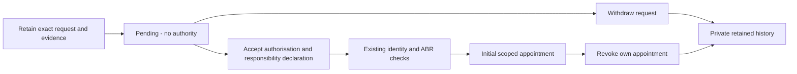

# Representative authority and initial appointments

[Implementation index](README.md) · [Accepted plan](../../architecture/company-managed-registers.md)

[Issue #862](https://github.com/Ledova/ledova/issues/862) provides private authority
requests, withdrawal and initial self-declaration admission on web and mobile.
A pending request grants no authority. Admission records the representative's
declaration and an effective initial appointment for the exact company, personal
capabilities, delegatable scope and expiry. Company activation and register
decisions retain their current workflows; an appointment supplies no approval of
a share instruction, payment or director decision.

Company details are **provided by the company**. The existing ABR lookup checks
entity facts; it does not make Ledova responsible for company information or
establish the representative's mandate. Use synthetic people, companies and
evidence in this experimental implementation.

## Company user steps

1. Sign up, verify your account email and register a draft company. Complete the
   existing representative identity check when configured for issuers.
2. Open **Representative authority** from the company details screen on web or
   mobile. Select the draft company you own; selection is explicit when you have
   several companies.
3. Choose personal capabilities and, separately, capabilities you intend to
   delegate. Initial admission requires personal company administration. Set an
   expiry if required. Selecting scopes alone grants no authority.
4. Upload supporting PDF, PNG or JPEG through the existing checked upload flow.
   No ASIC extract is required. The file remains private and retained.
5. Submit the request. The platform freezes the company and representative
   identities, scopes, expiry and evidence bytes. Review the captured information.
6. Accept the displayed declaration and choose the admission action. Version
   `2026-10-04` records: “I am authorised to act for this company. The company is
   responsible for the company and share information it provides, its ASIC filings
   and legal obligations.” The existing configured identity and ABR checks must
   pass; missing or mismatched results leave the request pending. Admission does
   not activate the company.
7. Read the appointment's personal and delegatable capabilities, expiry and
   current status. Download the retained evidence from your request history.
8. Withdraw an unwanted pending request. After admission, choose **Revoke
   appointment** and review the permanent loss of this appointment's company
   authority. Cancel to keep it, or confirm permanent revocation; its original
   declaration and evidence remain available. Another initial self-declaration
   cannot restore the appointment. Revocation does not admit a replacement
   representative or reopen initial admission.

Team invitations, delegation, legacy-owner migration and administrator-change
workflows remain later increments of #862. Current delegation scope is retained;
this increment has no invitation or grant-to-another-person action. Company
activation, register decisions and payments follow their owning issues in the
[dependency index](README.md#delivery-tracking).

## API and retained records

`/api/v1/company-authority/requests/` provides authenticated multipart submission
and paginated personal history. Detail and file actions resolve only the caller's
own request. Active accounts with verified email are required. New submissions
also require current ownership of the selected draft company. Public company
visibility, shareholder records and staff permissions do not widen this scope.

The server validates the upload and freezes raw and normalised identities,
file SHA256/size/type, requested scopes and expiry. It accepts no caller-supplied
verification result or representative account. Identical submission retries under
the same requester-scoped idempotency key return the retained request, including
after its company leaves draft or changes owner. Retries compare incoming bytes,
filename, MIME type and terms with the retained digest and current identities;
they do not rescan already retained evidence. New keys require upload validation
and current draft-company ownership. Changed inputs conflict.

`POST /api/v1/company-authority/requests/{uuid}/admit/` requires
`declaration_version: "2026-10-04"` and `accept_declaration: true`. The server
checks the exact retained request, live requester and configured identity result,
current draft-company ownership, unchanged captured identities and unexpired
scope. It runs the existing ABR adapter under a separate authority purpose and
checks its genuine result for that company and lifecycle revision before creating
an immutable initial appointment. A provider failure supplies no appointment.
Repeated admission returns the retained outcome. A company has only one initial
admission; expiry or revocation does not permit a new bootstrap.

`POST /api/v1/company-authority/requests/{uuid}/withdraw/` accepts an empty body
and records immutable requester withdrawal. Admission and withdrawal share the
request lock. Whichever commits first excludes the other outcome.

`POST /api/v1/company-authority/requests/{uuid}/revoke/` accepts an empty body
and records immutable self-revocation of the admitted appointment. Repeated
revocation returns its original outcome. Reads and files remain available.
Current-authority checks reject revoked or expired appointments and inactive
accounts. Existing signed-transaction recovery is unaffected; no new chain or
register command is introduced here.

## Database and upgrade boundaries

The app connection reads only its principal's requests, appointments and retained
outcomes. An appointment names its appointee and their profile; initial admission
records the request's requester as the appointee, and a company has one such
bootstrap appointment. It cannot create or alter these authority records directly. Bounded
operator services carry and restore the individual principal, lock and recheck
identities and exact scopes. Database triggers protect admission, withdrawal,
revocation and immutable history. Existing identity-provider results and the
configured issuer check remain server-owned; ordinary profile changes keep their
existing account scope.

Supporting files retain the [private-file lifecycle](../../architecture/files-and-retention.md).
Migration reversal refuses to discard populated admission/revocation history;
empty reversal preserves the earlier request and withdrawal lifecycle. Follow
[upgrade notes](../../operations/upgrades.md) and retain the database and private
storage together.

## Accepted decision and remaining work

The [owner's self-declaration decision](https://github.com/Ledova/ledova/issues/862#issuecomment-5973451112)
and [accepted refinements](https://github.com/Ledova/ledova/issues/862#issuecomment-5973465105)
supersede the earlier ASIC officeholder/InfoTrack route. No ASIC search, broker,
extract or InfoTrack agreement is a prerequisite. The company remains responsible
for its information, ASIC filings and legal obligations.

Company administrators change through existing company administrators or
court/regulator direction. Normal recovery of a person's own account is separate;
it supplies no appointment to a replacement administrator. Initial admission and
self-revocation implement neither disputed-access replacement nor a court-order
processing route.

Original #862 completion checks remain open for legacy-owner migration, multiple
appointments, invitations, in-app delegation and company team administration.
Later domain issues must convert their API/service/worker/RLS/trigger authority
boundaries together. No new fraud or impersonation verification is added. Any
identified legal duty on Ledova must be cited and raised with the owner before
building a check; see the dated [legal positions](../../legal/positions.md).
